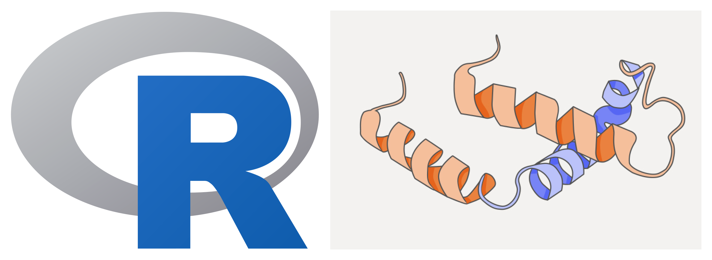

# r4proteomics 

A **5-day training** on proteomics data analysis using **R**.

## Materials:

- R and RStudio basics
- Processing and quality control of proteomics data
- Statistical analysis and differential expression
- Functional enrichment and pathway analysis
- Longitudinal studies and public datasets

## Authors:

* Miguel Casanova
* Dany Mukesha
