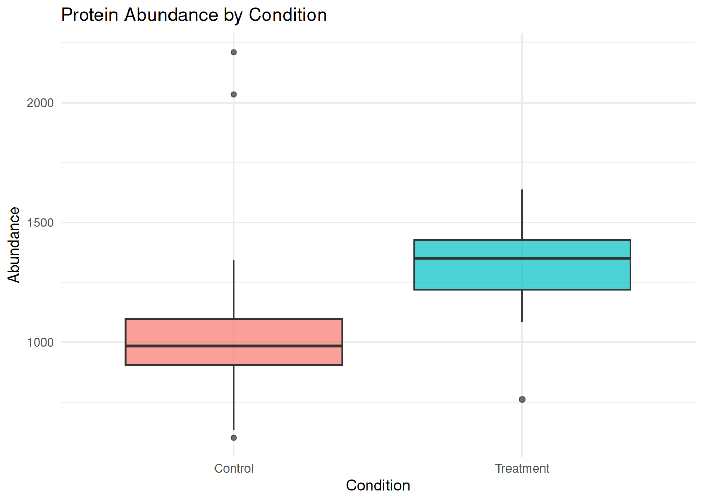
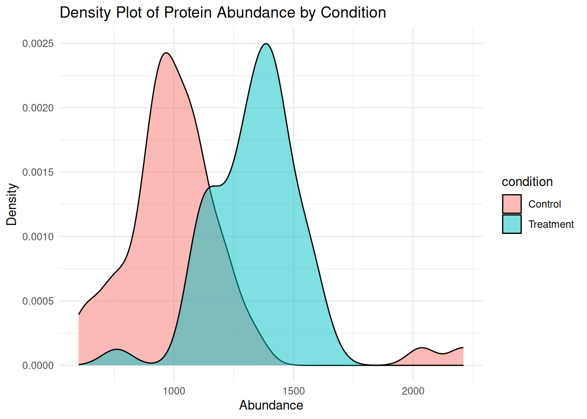

# Introduction to R and RStudio {#day1}


## Learning Objectives

By the end of Day 1, you will be able to:

-   Install and navigate RStudio effectively
-   Understand basic R data structures (vectors, data frames, lists)
-   Import and explore simple datasets
-   Write basic control flow structures and functions

## Module 1: Setting Up and Getting Started with R {#day1-mod1}

### Introduction

R is a powerful programming language and environment specifically designed for statistical computing and graphics. RStudio is an integrated development environment (IDE) that makes working with R much easier.

### Installing R and RStudio

1.  **Install R** (version 4.3.0 or higher)

    -   Visit <https://cran.r-project.org/>
    -   Download the version appropriate for your operating system
    -   Run the installer

2.  **Install RStudio Desktop**

    -   Visit <https://posit.co/download/rstudio-desktop/>
    -   Download the free Desktop version
    -   Run the installer

3.  **Install Required R Packages**

    Open an R session in the terminal or RStudio:

    ``` r
    # Install CRAN packages
    install.packages(c(
      "bookdown", "rmarkdown", "knitr", "pheatmap", "ggplot2", "downlit", "xml2",
      "reshape2", "gridExtra", "tidyverse", "lme4",
      "ggforce", "scatterpie", "png"  # Optional
    ))

    # Install Bioconductor packages
    if (!requireNamespace("BiocManager", quietly = TRUE))
      install.packages("BiocManager")

    BiocManager::install(c(
      "limma", "vsn", "sva", "clusterProfiler", "org.Hs.eg.db", "lme4",
      "KEGGREST", "AnnotationDbi", "annotate", "GO.db",
      "genefilter", "GOSemSim", "DOSE", "enrichplot"
    ), update = TRUE, ask = FALSE)
    ```

### RStudio Interface Tour

RStudio has four main panes:

1.  **Source Editor** (top-left): Where you write and edit your scripts
2.  **Console** (bottom-left): Where code is executed and results appear
3.  **Environment/History** (top-right): Shows objects in memory and command history
4.  **Files/Plots/Packages/Help** (bottom-right): File browser, plot viewer, package manager, and help documentation

### Scripts vs Console

The **Console** is for: - Quick calculations - Testing commands - Interactive exploration

**Scripts** (.R or .Rmd files) are for: - Saving your work - Creating reproducible analyses - Organizing complex workflows

### Basic Operators


``` r
# Arithmetic operators
5 + 3        # Addition
#> [1] 8
10 - 4       # Subtraction
#> [1] 6
6 * 7        # Multiplication
#> [1] 42
20 / 4       # Division
#> [1] 5
2 ^ 3        # Exponentiation
#> [1] 8
17 %% 5      # Modulo (remainder)
#> [1] 2

# Comparison operators
5 == 5       # Equal to
#> [1] TRUE
5 != 3       # Not equal to
#> [1] TRUE
7 > 3        # Greater than
#> [1] TRUE
4 < 8        # Less than
#> [1] TRUE
5 >= 5       # Greater than or equal
#> [1] TRUE
3 <= 10      # Less than or equal
#> [1] TRUE

# Logical operators
TRUE & FALSE  # AND
#> [1] FALSE
TRUE | FALSE  # OR
#> [1] TRUE
!TRUE         # NOT
#> [1] FALSE

# Scientific notation
1.5e6  # 1,500,000
#> [1] 1500000
```

**Tip:** Use descriptive variable names with underscores

### Variables & Assignment


``` r
# Assignment operator
x <- 10      # Assign 10 to x
y = 5        # Alternative (but <- is preferred)

## Assign values to variables
protein_count <- 800
sample_size <- 12
study_name <- "Proteomics_2025"

## View variables
protein_count
#> [1] 800
sample_size
#> [1] 12

## Use variables in calculations
total_measurements <- protein_count * sample_size
total_measurements
#> [1] 9600
```

### Data Types


``` r
# Numeric
intensity <- 25114306.44
class(intensity)
#> [1] "numeric"

# Character (text)
accession <- "F1LMU0"
class(accession)
#> [1] "character"

# Logical
is_significant <- TRUE
class(is_significant)
#> [1] "logical"

# Check type
is.numeric(intensity)
#> [1] TRUE
is.character(accession)
#> [1] TRUE
```

### Creating Your First Script


``` r
# Create a new R script: File > New File > R Script
# Or use Ctrl+Shift+N (Windows/Linux) or Cmd+Shift+N (Mac)

# Write your code
message("Hello, Proteomics World!")

# Save your script: File > Save
# Run code: Ctrl+Enter (Windows/Linux) or Cmd+Return (Mac)
```

### Exercise 1.1: First Steps

Create a new R script and:

1.  Calculate the sum of 123 and 456
2.  Assign the result to a variable called `total`
3.  Print the value of `total`
4.  Calculate what percentage 123 is of the total


```{.r .fold-hide}
# Solution
result1 <- 123 + 456
total <- result1
print(total)
#> [1] 579

percentage <- (123 / total) * 100
print(paste0("123 is ", round(percentage, 2), "% of the total"))
#> [1] "123 is 21.24% of the total"
```

## Module 2: Data Types and Structures {#day1-mod2}

### Vectors

Vectors are the most basic data structure in R. They contain elements of the same type.


``` r
# Numeric vectors
ages <- c(25, 30, 35, 40, 45)
print(ages)
#> [1] 25 30 35 40 45

# Character vectors
names <- c("Alice", "Bob", "Charlie", "Diana", "Eve")
print(names)
#> [1] "Alice"   "Bob"     "Charlie" "Diana"   "Eve"

# Logical vectors
passed_qc <- c(TRUE, TRUE, FALSE, TRUE, TRUE)
print(passed_qc)
#> [1]  TRUE  TRUE FALSE  TRUE  TRUE

# Sequences
seq_1_10 <- 1:10
seq_custom <- seq(from = 0, to = 100, by = 10)

# Vector operations
mean(ages)
#> [1] 35
```

### Indexing and Subsetting


``` r
# Access elements by position (1-indexed!)
ages[1]           # First element
#> [1] 25
ages[c(1, 3, 5)]  # Multiple elements
#> [1] 25 35 45
ages[-2]          # All except second element
#> [1] 25 35 40 45

# Logical indexing
ages[ages > 35]   # Elements greater than 35
#> [1] 40 45

# Named vectors
protein_abundance <- c(ACTB = 1500, GAPDH = 2000, MYC = 800)
protein_abundance["ACTB"]
#> ACTB 
#> 1500
```

### Data Frames

Data frames are the most common structure for storing tabular data.


``` r
# Create a data frame
patient_data <- data.frame(
  patient_id = 1:5,
  name = c("Alice", "Bob", "Charlie", "Diana", "Eve"),
  age = c(25, 30, 35, 40, 45),
  treatment = c("A", "B", "A", "B", "A"),
  response = c(TRUE, TRUE, FALSE, TRUE, FALSE),
  stringsAsFactors = FALSE
)

print(patient_data)
#>   patient_id    name age treatment response
#> 1          1   Alice  25         A     TRUE
#> 2          2     Bob  30         B     TRUE
#> 3          3 Charlie  35         A    FALSE
#> 4          4   Diana  40         B     TRUE
#> 5          5     Eve  45         A    FALSE

# View structure
str(patient_data)
#> 'data.frame':	5 obs. of  5 variables:
#>  $ patient_id: int  1 2 3 4 5
#>  $ name      : chr  "Alice" "Bob" "Charlie" "Diana" ...
#>  $ age       : num  25 30 35 40 45
#>  $ treatment : chr  "A" "B" "A" "B" ...
#>  $ response  : logi  TRUE TRUE FALSE TRUE FALSE

# Summary statistics
summary(patient_data)
#>    patient_id     name                age    
#>  Min.   :1    Length:5           Min.   :25  
#>  1st Qu.:2    Class :character   1st Qu.:30  
#>  Median :3    Mode  :character   Median :35  
#>  Mean   :3                       Mean   :35  
#>  3rd Qu.:4                       3rd Qu.:40  
#>  Max.   :5                       Max.   :45  
#>   treatment          response      
#>  Length:5           Mode :logical  
#>  Class :character   FALSE:2        
#>  Mode  :character   TRUE :3        
#>                                    
#>                                    
#> 

# Access columns
patient_data$age
#> [1] 25 30 35 40 45
patient_data[, "name"]
#> [1] "Alice"   "Bob"     "Charlie" "Diana"   "Eve"
patient_data[, 2]
#> [1] "Alice"   "Bob"     "Charlie" "Diana"   "Eve"

# Access rows
patient_data[1, ]           # First row
#>   patient_id  name age treatment response
#> 1          1 Alice  25         A     TRUE
patient_data[1:3, ]         # First three rows
#>   patient_id    name age treatment response
#> 1          1   Alice  25         A     TRUE
#> 2          2     Bob  30         B     TRUE
#> 3          3 Charlie  35         A    FALSE

# Access specific cells
patient_data[2, 3]          # Row 2, Column 3
#> [1] 30
patient_data[2, "age"]      # Same, using column name
#> [1] 30

# Subset by condition
patient_data[patient_data$age > 30, ]
#>   patient_id    name age treatment response
#> 3          3 Charlie  35         A    FALSE
#> 4          4   Diana  40         B     TRUE
#> 5          5     Eve  45         A    FALSE
patient_data[patient_data$treatment == "A", ]
#>   patient_id    name age treatment response
#> 1          1   Alice  25         A     TRUE
#> 3          3 Charlie  35         A    FALSE
#> 5          5     Eve  45         A    FALSE
```

#### Exploring Data Frames


``` r
# View first rows
head(patient_data, 2)
#>   patient_id  name age treatment response
#> 1          1 Alice  25         A     TRUE
#> 2          2   Bob  30         B     TRUE

# Dimensions
dim(patient_data)
#> [1] 5 5
nrow(patient_data)
#> [1] 5
ncol(patient_data)
#> [1] 5

# Column names
colnames(patient_data)
#> [1] "patient_id" "name"       "age"        "treatment" 
#> [5] "response"
```

#### Accessing Data Frame Elements


``` r
# Access column by name
patient_data$name
#> [1] "Alice"   "Bob"     "Charlie" "Diana"   "Eve"

# Access using brackets [row, column]
patient_data[1, 3]        # Row 1, column 3
#> [1] 25
patient_data[1:2, ]       # First 2 rows, all columns
#>   patient_id  name age treatment response
#> 1          1 Alice  25         A     TRUE
#> 2          2   Bob  30         B     TRUE
patient_data[, "treatment"]    # All rows, Mass column
#> [1] "A" "B" "A" "B" "A"

# Subset data
patient_data[patient_data$age > 30, ]
#>   patient_id    name age treatment response
#> 3          3 Charlie  35         A    FALSE
#> 4          4   Diana  40         B     TRUE
#> 5          5     Eve  45         A    FALSE
```

### Lists

Lists can contain elements of different types and structures.


``` r
# Create a list
experiment <- list(
  experiment_id = "EXP001",
  date = "2025-01-15",
  samples = c("S1", "S2", "S3"),
  data = patient_data,
  validated = TRUE
)

# Access list elements
experiment$experiment_id
#> [1] "EXP001"
experiment[[1]]
#> [1] "EXP001"
experiment[["samples"]]
#> [1] "S1" "S2" "S3"
```

### Factors

Factors are used for categorical data.


``` r
# Create factor
treatment_factor <- factor(c("Control", "Drug A", "Drug B", "Control", "Drug A"))
print(treatment_factor)
#> [1] Control Drug A  Drug B  Control Drug A 
#> Levels: Control Drug A Drug B

# Check levels
levels(treatment_factor)
#> [1] "Control" "Drug A"  "Drug B"

# Ordered factors
severity <- factor(
  c("Mild", "Severe", "Moderate", "Mild", "Severe"),
  levels = c("Mild", "Moderate", "Severe"),
  ordered = TRUE
)
print(severity)
#> [1] Mild     Severe   Moderate Mild     Severe  
#> Levels: Mild < Moderate < Severe
```

### Type Coercion


``` r
# Implicit coercion
mixed <- c(1, 2, "three", 4)  # All converted to character
print(mixed)
#> [1] "1"     "2"     "three" "4"

# Explicit coercion
numbers_char <- c("1", "2", "3", "4")
numbers_num <- as.numeric(numbers_char)
print(numbers_num)
#> [1] 1 2 3 4

# Check types
class(mixed)
#> [1] "character"
is.numeric(mixed)
#> [1] FALSE
is.character(mixed)
#> [1] TRUE
```

### Exercise 1.2: Data Structures

Create a data frame for a proteomic experiment with:

-   10 protein IDs (P001 to P010)
-   Random abundance values between 100 and 5000
-   Random p-values between 0 and 1
-   Significance status (TRUE if p-value \< 0.05)


```{.r .fold-hide}
# Solution
set.seed(42)  # For reproducibility

proteins <- data.frame(
  protein_id = paste0("P", sprintf("%03d", 1:10)),
  abundance = round(runif(10, min = 100, max = 5000), 2),
  p_value = runif(10, min = 0, max = 1),
  stringsAsFactors = FALSE
)

proteins$significant <- proteins$p_value < 0.05

print(proteins)
#>    protein_id abundance   p_value significant
#> 1        P001   4582.55 0.4577418       FALSE
#> 2        P002   4691.67 0.7191123       FALSE
#> 3        P003   1502.08 0.9346722       FALSE
#> 4        P004   4169.19 0.2554288       FALSE
#> 5        P005   3244.55 0.4622928       FALSE
#> 6        P006   2643.57 0.9400145       FALSE
#> 7        P007   3709.28 0.9782264       FALSE
#> 8        P008    759.87 0.1174874       FALSE
#> 9        P009   3319.26 0.4749971       FALSE
#> 10       P010   3554.82 0.5603327       FALSE

# Summary
cat("\nNumber of significant proteins:", sum(proteins$significant), "\n")
#> 
#> Number of significant proteins: 0
```

## Module 3: Control Flow and Functions {#day1-mod3}

### Conditional Statements


``` r
# if statement
x <- 10

if (x > 5) {
  print("x is greater than 5")
}
#> [1] "x is greater than 5"

# if-else
if (x > 15) {
  print("x is greater than 15")
} else {
  print("x is 15 or less")
}
#> [1] "x is 15 or less"

# if-else if-else
score <- 75

if (score >= 90) {
  grade <- "A"
} else if (score >= 80) {
  grade <- "B"
} else if (score >= 70) {
  grade <- "C"
} else {
  grade <- "F"
}

print(paste("Grade:", grade))
#> [1] "Grade: C"

# Vectorized ifelse
values <- c(1, 5, 10, 15, 20)
categories <- ifelse(values > 10, "High", "Low")
print(categories)
#> [1] "Low"  "Low"  "Low"  "High" "High"
```

### Loops


``` r
# for loop
for (i in 1:5) {
  print(paste("Iteration:", i))
}
#> [1] "Iteration: 1"
#> [1] "Iteration: 2"
#> [1] "Iteration: 3"
#> [1] "Iteration: 4"
#> [1] "Iteration: 5"

# Loop through vector
proteins <- c("ACTB", "GAPDH", "MYC")
for (protein in proteins) {
  print(paste("Processing:", protein))
}
#> [1] "Processing: ACTB"
#> [1] "Processing: GAPDH"
#> [1] "Processing: MYC"

# while loop
counter <- 1
while (counter <= 5) {
  print(paste("Counter:", counter))
  counter <- counter + 1
}
#> [1] "Counter: 1"
#> [1] "Counter: 2"
#> [1] "Counter: 3"
#> [1] "Counter: 4"
#> [1] "Counter: 5"

# Loop with condition
numbers <- 1:10
for (num in numbers) {
  if (num %% 2 == 0) {
    print(paste(num, "is even"))
  }
}
#> [1] "2 is even"
#> [1] "4 is even"
#> [1] "6 is even"
#> [1] "8 is even"
#> [1] "10 is even"
```

### Functions


``` r
# Basic function
greet <- function(name) {
  message <- paste("Hello,", name, "!")
  return(message)
}

greet("Alice")
#> [1] "Hello, Alice !"

# Function with multiple parameters
calculate_fold_change <- function(treatment, control) {
  fc <- treatment / control
  log2_fc <- log2(fc)
  return(log2_fc)
}

calculate_fold_change(treatment = 200, control = 100)
#> [1] 1

# Function with default parameters
normalize_abundance <- function(abundance, method = "median") {
  if (method == "median") {
    normalized <- abundance / median(abundance, na.rm = TRUE)
  } else if (method == "mean") {
    normalized <- abundance / mean(abundance, na.rm = TRUE)
  } else {
    stop("Method must be 'median' or 'mean'")
  }
  return(normalized)
}

values <- c(100, 200, 300, 400, 500)
normalize_abundance(values)
#> [1] 0.3333333 0.6666667 1.0000000 1.3333333 1.6666667
normalize_abundance(values, method = "mean")
#> [1] 0.3333333 0.6666667 1.0000000 1.3333333 1.6666667
```

### Apply Family Functions


``` r
# Create sample data
protein_matrix <- matrix(
  c(100, 150, 200, 250, 
    110, 160, 210, 260,
    120, 170, 220, 270),
  nrow = 3, byrow = TRUE
)
colnames(protein_matrix) <- c("Sample1", "Sample2", "Sample3", "Sample4")
rownames(protein_matrix) <- c("Protein1", "Protein2", "Protein3")

print(protein_matrix)
#>          Sample1 Sample2 Sample3 Sample4
#> Protein1     100     150     200     250
#> Protein2     110     160     210     260
#> Protein3     120     170     220     270

# apply: apply function to rows or columns
row_means <- apply(protein_matrix, 1, mean)  # 1 = rows
col_means <- apply(protein_matrix, 2, mean)  # 2 = columns

print(row_means)
#> Protein1 Protein2 Protein3 
#>      175      185      195
print(col_means)
#> Sample1 Sample2 Sample3 Sample4 
#>     110     160     210     260

# lapply: apply function to list, returns list
my_list <- list(a = 1:5, b = 6:10, c = 11:15)
list_means <- lapply(my_list, mean)
print(list_means)
#> $a
#> [1] 3
#> 
#> $b
#> [1] 8
#> 
#> $c
#> [1] 13

# sapply: simplified version of lapply
vector_means <- sapply(my_list, mean)
print(vector_means)
#>  a  b  c 
#>  3  8 13
```

### Exercise 1.3: Functions and Loops

Write a function that:

1.  Takes a vector of protein abundances
2.  Calculates the coefficient of variation (CV = sd/mean \* 100)
3.  Returns "Pass" if CV \< 20%, "Fail" otherwise

Apply this function to multiple samples using a loop.


```{.r .fold-hide}
# Solution
calculate_cv_status <- function(abundances) {
  cv <- (sd(abundances, na.rm = TRUE) / mean(abundances, na.rm = TRUE)) * 100
  
  if (cv < 20) {
    status <- "Pass"
  } else {
    status <- "Fail"
  }
  
  return(list(cv = round(cv, 2), status = status))
}

# Create sample data
sample_data <- list(
  sample1 = c(100, 105, 98, 102, 99),
  sample2 = c(100, 150, 90, 200, 80),
  sample3 = c(500, 505, 498, 502, 496)
)

# Apply function
for (sample_name in names(sample_data)) {
  result <- calculate_cv_status(sample_data[[sample_name]])
  cat(sample_name, "- CV:", result$cv, "% - Status:", result$status, "\n")
}
#> sample1 - CV: 2.75 % - Status: Pass 
#> sample2 - CV: 40.56 % - Status: Fail 
#> sample3 - CV: 0.7 % - Status: Pass
```

## Module 4: Data Visualization with `ggplot2` {#day1-mod5}

In this module, we will explore how to visualize data using **ggplot2**, one of the most powerful and flexible plotting systems in R.

------------------------------------------------------------------------

### Loading Required Packages


``` r
# Load necessary library
library(ggplot2)
```

------------------------------------------------------------------------

### Example Dataset

We'll first create an example dataset representing protein abundance under two conditions: *Control* and *Treatment*.


``` r
set.seed(42)

# Simulate realistic protein abundance data

n_proteins <- 100

protein_data <- data.frame(
protein_id = paste0("P", sprintf("%03d", 1:n_proteins)),
abundance = c(
rnorm(n_proteins / 2, mean = 1000, sd = 150),   # Control group
rnorm(n_proteins / 2, mean = 1300, sd = 180)    # Treatment group
),
condition = rep(c("Control", "Treatment"), each = n_proteins / 2)
)

# Add a few outliers to make the data more realistic
outlier_indices <- sample(1:n_proteins, 3)
protein_data$abundance[outlier_indices] <- 
  protein_data$abundance[outlier_indices] * runif(3, 1.5, 2)

head(protein_data)
#>   protein_id abundance condition
#> 1       P001 1205.6438   Control
#> 2       P002  915.2953   Control
#> 3       P003 1054.4693   Control
#> 4       P004 1094.9294   Control
#> 5       P005 1060.6402   Control
#> 6       P006  984.0813   Control
```

------------------------------------------------------------------------

### Histogram: Distribution of Protein Abundance

A **histogram** helps visualize the distribution of continuous variables such as protein abundance.


``` r
ggplot(protein_data, aes(x = abundance)) +
  geom_histogram(binwidth = 100, fill = "steelblue", color = "white") +
  labs(
    title = "Distribution of Protein Abundance",
    x = "Abundance",
    y = "Count"
  ) +
  theme_minimal()
```


------------------------------------------------------------------------

### Boxplot: Comparing Conditions

A **boxplot** provides a compact summary of abundance values across conditions.


``` r
ggplot(protein_data, aes(x = condition, y = abundance, fill = condition)) +
  geom_boxplot(alpha = 0.7) +
  labs(
    title = "Protein Abundance by Condition",
    x = "Condition",
    y = "Abundance"
  ) +
  theme_minimal() +
  theme(legend.position = "none")
```



------------------------------------------------------------------------

### Scatter Plot: Individual Points with Mean Values

A **scatter plot** with **jittering** can display individual data points while avoiding overlap. Adding **mean points** provides an overview of group averages.


``` r
ggplot(protein_data, aes(x = condition, y = abundance, color = condition)) +
  geom_jitter(width = 0.2, alpha = 0.6) +
  stat_summary(fun = mean, geom = "point", size = 4, shape = 18, color = "black") +
  labs(
    title = "Abundance per Condition with Mean Values",
    x = "Condition",
    y = "Abundance"
  ) +
  theme_minimal()
```


------------------------------------------------------------------------

### Density Plot: Distribution by Condition

A **density plot** shows the smoothed distribution of abundance values for each condition.


``` r
ggplot(protein_data, aes(x = abundance, fill = condition)) +
  geom_density(alpha = 0.5) +
  labs(
    title = "Density Plot of Protein Abundance by Condition",
    x = "Abundance",
    y = "Density"
  ) +
  theme_minimal()
```



------------------------------------------------------------------------

### Summary

In this module, you learned how to:

-   Visualize distributions using histograms and density plots
-   Compare groups using boxplots
-   Display individual data points with jitter and summary statistics

These visualizations are essential for exploring proteomics data and identifying trends or outliers before further statistical analysis.

## Module 5: Importing and Exploring Data

### Reading CSV Files


``` r
# Read CSV
data <- read.csv("data/proteins.csv")

# Read with tidyverse
library(readr)
data <- read_csv("data/proteins.csv")

# Read tab-delimited
data <- read.delim("data/proteins.txt", sep = "\t")
```

### Basic Data Exploration


``` r
# Create example data
set.seed(123)
protein_data <- data.frame(
  protein_id = paste0("P", 1:100),
  abundance = rnorm(100, mean = 1000, sd = 200),
  condition = rep(c("Control", "Treatment"), each = 50)
)

# Dimensions
dim(protein_data)
#> [1] 100   3
nrow(protein_data)
#> [1] 100
ncol(protein_data)
#> [1] 3

# First and last rows
head(protein_data)
#>   protein_id abundance condition
#> 1         P1  887.9049   Control
#> 2         P2  953.9645   Control
#> 3         P3 1311.7417   Control
#> 4         P4 1014.1017   Control
#> 5         P5 1025.8575   Control
#> 6         P6 1343.0130   Control
tail(protein_data)
#>     protein_id abundance condition
#> 95         P95 1272.1305 Treatment
#> 96         P96  879.9481 Treatment
#> 97         P97 1437.4666 Treatment
#> 98         P98 1306.5221 Treatment
#> 99         P99  952.8599 Treatment
#> 100       P100  794.7158 Treatment

# Summary statistics
summary(protein_data)
#>   protein_id          abundance       condition        
#>  Length:100         Min.   : 538.2   Length:100        
#>  Class :character   1st Qu.: 901.2   Class :character  
#>  Mode  :character   Median :1012.4   Mode  :character  
#>                     Mean   :1018.1                     
#>                     3rd Qu.:1138.4                     
#>                     Max.   :1437.5

# Table for categorical data
table(protein_data$condition)
#> 
#>   Control Treatment 
#>        50        50
```

## Module 6: Data Wrangling with tidyverse

### Introduction to tidyverse

**What is tidyverse?**

-   Collection of R packages for data science
-   Consistent syntax and design philosophy
-   Main packages: dplyr, tidyr, ggplot2, readr

**Why tidyverse?**

-   Readable, intuitive code
-   Pipe operator `%>%` for chaining operations
-   Faster learning curve
-   Industry standard


``` r
library(tidyverse)
```

------------------------------------------------------------------------

### The Pipe Operator %\>%

**Traditional approach:**


``` r
x <- c(1, 2, 3, 4, 5)
result <- mean(log10(sqrt(x)))
result
#> [1] 0.2079181
```

**With pipe operator:**


``` r
result <- x %>% 
  sqrt() %>% 
  log10() %>% 
  mean()
result
#> [1] 0.2079181
```

**Read as:** "Take x, THEN take square root, THEN take log10, THEN calculate mean"

------------------------------------------------------------------------

### dplyr: Grammar of Data Manipulation

**Key Functions:**

-   `select()` - Choose columns
-   `filter()` - Choose rows based on conditions
-   `mutate()` - Create or modify columns
-   `arrange()` - Sort data
-   `summarize()` - Calculate summary statistics
-   `group_by()` - Group data for operations

------------------------------------------------------------------------

### Your Actual Proteomics Data Structure


``` r
# Simulate your data structure
set.seed(123)
proteomics_data <- readxl::read_excel(
    path = "examples/2126001_Protein Export_ex.xlsx", #this should the file example that genethon provided
    skip = 1
)
proteomics_data <- proteomics_data %>%
    select(where(~ any(!is.na(.))))

head(proteomics_data[, 1:10])
#> # A tibble: 6 × 10
#>   Accession  Gene       `Peptide count` `Unique peptides`
#>   <chr>      <chr>                <dbl>             <dbl>
#> 1 F1LMU0     F1LMU0                 338               138
#> 2 G3V8V3     G3V8V3                 146               113
#> 3 A0A0G2JSP8 A0A0G2JSP8             117               109
#> 4 Q64578     AT2A1                  126                89
#> 5 D4AEH9     D4AEH9                  87                83
#> 6 P15429     ENOB                   110                83
#> # ℹ 6 more variables: `Confidence score` <dbl>, Mass <dbl>,
#> #   Description <chr>, `2126001_029_F5` <dbl>,
#> #   `2126001_359_F9` <dbl>, `2126001_401_F1` <dbl>
```

Good practice: Convert all column names to lowercase and replace spaces with underscores `_`, to keep the naming of colmuns cleaner and more consistent.


``` r
#colnames(proteomics_data) <- tolower(colnames(proteomics_data))
colnames(proteomics_data) <- gsub(" ", "_", tolower(colnames(proteomics_data)))
```

------------------------------------------------------------------------

### select(): Choose Columns


``` r
# Select specific columns
proteomics_data %>%
  select(accession, gene, mass, `2126001_029_f5`) %>%
  head(3)
#> # A tibble: 3 × 4
#>   accession  gene          mass `2126001_029_f5`
#>   <chr>      <chr>        <dbl>            <dbl>
#> 1 F1LMU0     F1LMU0     222850.        25114306.
#> 2 G3V8V3     G3V8V3      97288.        18519365.
#> 3 A0A0G2JSP8 A0A0G2JSP8  43019.       897562438.

# Select range of columns
proteomics_data %>%
  select(accession:mass) %>%
  head(3)
#> # A tibble: 3 × 6
#>   accession  gene       peptide_count unique_peptides
#>   <chr>      <chr>              <dbl>           <dbl>
#> 1 F1LMU0     F1LMU0               338             138
#> 2 G3V8V3     G3V8V3               146             113
#> 3 A0A0G2JSP8 A0A0G2JSP8           117             109
#> # ℹ 2 more variables: confidence_score <dbl>, mass <dbl>

# Select columns containing "sample"
proteomics_data %>%
  select(accession, contains("f5")) %>%
  head(3)
#> # A tibble: 3 × 2
#>   accession  `2126001_029_f5`
#>   <chr>                 <dbl>
#> 1 F1LMU0            25114306.
#> 2 G3V8V3            18519365.
#> 3 A0A0G2JSP8       897562438.
```

------------------------------------------------------------------------

### filter(): Choose Rows


``` r
# Filter high mass proteins
proteomics_data %>%
  filter(mass > 100000) %>%
  select(accession, gene, mass)
#> # A tibble: 87 × 3
#>    accession  gene          mass
#>    <chr>      <chr>        <dbl>
#>  1 F1LMU0     F1LMU0     222850.
#>  2 Q64578     AT2A1      109409.
#>  3 D4AEH9     D4AEH9     174331.
#>  4 G3V7K1     G3V7K1     164712.
#>  5 A0A0G2K5P5 A0A0G2K5P5 187602.
#>  6 D3ZA38     D3ZA38     128936.
#>  7 Q03626     MUG1       165326 
#>  8 Q8R4I6     Q8R4I6     103013.
#>  9 D3ZHA0     FLNC       290984.
#> 10 A0A096MK15 A0A096MK15 772118.
#> # ℹ 77 more rows

# Multiple conditions (AND)
proteomics_data %>%
  filter(mass > 100000 & peptide_count > 100) %>%
  select(accession, gene, mass, peptide_count)
#> # A tibble: 7 × 4
#>   accession  gene          mass peptide_count
#>   <chr>      <chr>        <dbl>         <dbl>
#> 1 F1LMU0     F1LMU0     222850.           338
#> 2 Q64578     AT2A1      109409.           126
#> 3 A0A096MK15 A0A096MK15 772118.           133
#> 4 F1LRV9     F1LRV9     223400.           240
#> 5 G3V6E1     G3V6E1     219575.           173
#> 6 F1LMY4     RYR1       565491.           104
#> 7 A0A0G2K5J1 A0A0G2K5J1 563314.           102

# OR conditions
proteomics_data %>%
  filter(mass > 200000 | peptide_count > 300) %>%
  select(accession, gene, mass, peptide_count)
#> # A tibble: 29 × 4
#>    accession  gene          mass peptide_count
#>    <chr>      <chr>        <dbl>         <dbl>
#>  1 F1LMU0     F1LMU0     222850.           338
#>  2 D3ZHA0     FLNC       290984.            55
#>  3 A0A096MK15 A0A096MK15 772118.           133
#>  4 F1LRV9     F1LRV9     223400.           240
#>  5 A0A0G2JU96 A0A0G2JU96 571866.            34
#>  6 M0R9L0     M0R9L0     220194.            28
#>  7 A0A0G2K7B6 A0A0G2K7B6 242460.            24
#>  8 F7F9U6     F7F9U6     517417.            16
#>  9 A0A0G2JUP3 A0A0G2JUP3 815466.             8
#> 10 G3V6E1     G3V6E1     219575.           173
#> # ℹ 19 more rows
```

------------------------------------------------------------------------

### mutate(): Create New Columns


``` r
# Calculate log10 transformed values
proteomics_data %>%
  mutate(
    log10_mass = log10(mass)
  ) %>%
  select(accession, mass, log10_mass, `2126001_029_f5`) %>%
  head(3)
#> # A tibble: 3 × 4
#>   accession     mass log10_mass `2126001_029_f5`
#>   <chr>        <dbl>      <dbl>            <dbl>
#> 1 F1LMU0     222850.       5.35        25114306.
#> 2 G3V8V3      97288.       4.99        18519365.
#> 3 A0A0G2JSP8  43019.       4.63       897562438.
```

------------------------------------------------------------------------

### arrange(): Sort Data


``` r
# Sort by mass (ascending)
proteomics_data %>%
  arrange(mass) %>%
  select(accession, gene, mass) %>%
  head(3)
#> # A tibble: 3 × 3
#>   accession gene    mass
#>   <chr>     <chr>  <dbl>
#> 1 P29418    ATP5E  5767.
#> 2 Q9JJW3    ATPMK  6408.
#> 3 A9UMV7    A9UMV7 6539.

# Sort descending
proteomics_data %>%
  arrange(desc(mass)) %>%
  select(accession, gene, mass) %>%
  head(3)
#> # A tibble: 3 × 3
#>   accession  gene          mass
#>   <chr>      <chr>        <dbl>
#> 1 A0A0G2JUP3 A0A0G2JUP3 815466.
#> 2 A0A096MK15 A0A096MK15 772118.
#> 3 F1M1J2     F1M1J2     623402.

# Sort by multiple columns
proteomics_data %>%
  arrange(desc(peptide_count), mass) %>%
  select(accession, peptide_count, mass) %>%
  head(3)
#> # A tibble: 3 × 3
#>   accession peptide_count    mass
#>   <chr>             <dbl>   <dbl>
#> 1 F1LMU0              338 222850.
#> 2 F1LRV9              240 223400.
#> 3 G3V6E1              173 219575.
```

------------------------------------------------------------------------

### summarize(): Calculate Statistics


``` r
# Calculate summary statistics
proteomics_data %>%
  summarize(
    n_proteins = n(),
    mean_mass = mean(mass),
    median_mass = median(mass),
    sd_mass = sd(mass),
    mean_intensity = mean(`2126001_029_f5`)
  )
#> # A tibble: 1 × 5
#>   n_proteins mean_mass median_mass sd_mass mean_intensity
#>        <int>     <dbl>       <dbl>   <dbl>          <dbl>
#> 1        824    57788.      39318.  75984.       3059149.

# Multiple samples
proteomics_data %>%
  summarize(
    mean_s1 = mean(`2126001_029_f5`),
    mean_s2 = mean(`2126001_359_f9`),
    cv_s1 = sd(`2126001_029_f5`) / mean(`2126001_029_f5`) * 100
  )
#> # A tibble: 1 × 3
#>    mean_s1  mean_s2 cv_s1
#>      <dbl>    <dbl> <dbl>
#> 1 3059149. 3367563. 1102.
```

------------------------------------------------------------------------

### group_by(): Grouped Operations


``` r
# Create groups based on mass
proteomics_data_grouped <- proteomics_data %>%
  mutate(
    mass_category = case_when(
      mass < 50000 ~ "Low",
      mass < 150000 ~ "Medium",
      TRUE ~ "High"
    )
  )

# Calculate statistics by group
proteomics_data_grouped %>%
  group_by(mass_category) %>%
  summarize(
    n_proteins = n(),
    mean_peptides = mean(peptide_count),
    mean_confidence = mean(confidence_score)
  )
#> # A tibble: 3 × 4
#>   mass_category n_proteins mean_peptides mean_confidence
#>   <chr>              <int>         <dbl>           <dbl>
#> 1 High                  43         45.8            4136.
#> 2 Low                  529          8.71            814.
#> 3 Medium               252         13.6            1176.
```

------------------------------------------------------------------------

### Combining Operations: Pipeline


``` r
# Complete analysis pipeline
results <- proteomics_data %>%
  # Filter high confidence proteins
  filter(confidence_score > 10000) %>%
  # Calculate mean intensity across samples
  mutate(
    mean_intensity = rowMeans(select(., starts_with("sample")))
  ) %>%
  # Keep relevant columns
  select(accession, gene, mass, confidence_score, mean_intensity) %>%
  # Sort by mean intensity
  arrange(desc(mean_intensity))

head(results)
#> # A tibble: 6 × 5
#>   accession  gene       mass confidence_score mean_intensity
#>   <chr>      <chr>     <dbl>            <dbl>          <dbl>
#> 1 F1LMU0     F1LMU0   2.23e5           40162.            NaN
#> 2 G3V8V3     G3V8V3   9.73e4           15646.            NaN
#> 3 A0A0G2JSP8 A0A0G2J… 4.30e4           15567.            NaN
#> 4 Q64578     AT2A1    1.09e5           14102.            NaN
#> 5 P15429     ENOB     4.70e4           12564.            NaN
#> 6 P05065     ALDOA    3.94e4           11642.            NaN
```

------------------------------------------------------------------------

### tidyr: Reshaping Data

**Key Functions:**

-   `pivot_longer()` - Wide to long format
-   `pivot_wider()` - Long to wide format
-   `separate()` - Split one column into multiple
-   `unite()` - Combine columns

**Why reshape?** Different analyses and visualizations require different formats

------------------------------------------------------------------------

### Wide vs Long Format

**Wide format (your current data):**

```         
accession  `2126001_029_f5`  `2126001_359_f9`  sample_3
F1LMU0     2511430   8316460   3577492
G3V8V3     1851936   2066635   2986710
```

**Long format:**

```         
accession  Sample     Intensity
F1LMU0     `2126001_029_f5`   2511430
F1LMU0     `2126001_359_f9`   8316460
F1LMU0     sample_3   3577492
G3V8V3     `2126001_029_f5`   1851936
```

------------------------------------------------------------------------

### pivot_longer(): Wide to Long


``` r
# Convert to long format
proteomics_long <- proteomics_data %>%
  pivot_longer(
    cols = starts_with("2"),
    names_to = "Sample",
    values_to = "Intensity"
  )

head(proteomics_long, 10)
#> # A tibble: 10 × 9
#>    accession gene   peptide_count unique_peptides
#>    <chr>     <chr>          <dbl>           <dbl>
#>  1 F1LMU0    F1LMU0           338             138
#>  2 F1LMU0    F1LMU0           338             138
#>  3 F1LMU0    F1LMU0           338             138
#>  4 F1LMU0    F1LMU0           338             138
#>  5 F1LMU0    F1LMU0           338             138
#>  6 F1LMU0    F1LMU0           338             138
#>  7 F1LMU0    F1LMU0           338             138
#>  8 F1LMU0    F1LMU0           338             138
#>  9 F1LMU0    F1LMU0           338             138
#> 10 F1LMU0    F1LMU0           338             138
#> # ℹ 5 more variables: confidence_score <dbl>, mass <dbl>,
#> #   description <chr>, Sample <chr>, Intensity <dbl>
```

------------------------------------------------------------------------

### Why Long Format?

**Advantages for analysis:**

-   Easier grouping and summarizing
-   Better for ggplot2 visualizations
-   Facilitates statistical modeling
-   Standard format for many tools


``` r
# Calculate statistics by sample
proteomics_long %>%
  group_by(Sample) %>%
  summarize(
    mean_intensity = mean(Intensity),
    median_intensity = median(Intensity),
    n_proteins = n()
  ) %>%
  head(6)
#> # A tibble: 6 × 4
#>   Sample          mean_intensity median_intensity n_proteins
#>   <chr>                    <dbl>            <dbl>      <int>
#> 1 2126001_029_f5        3059149.           91354.        824
#> 2 2126001_068_f3        3782834.           76089.        824
#> 3 2126001_134_f11       3189430.           84892.        824
#> 4 2126001_180_f2        2687642.          129483.        824
#> 5 2126001_198_f12       2881252.           93655.        824
#> 6 2126001_270_f7        2088286.           95672.        824
```

------------------------------------------------------------------------

### pivot_wider(): Long to Wide


``` r
# Convert back to wide format
proteomics_wide <- proteomics_long %>%
  pivot_wider(
    names_from = Sample,
    values_from = Intensity
  )

head(proteomics_wide[, 1:10])
#> # A tibble: 6 × 10
#>   accession  gene       peptide_count unique_peptides
#>   <chr>      <chr>              <dbl>           <dbl>
#> 1 F1LMU0     F1LMU0               338             138
#> 2 G3V8V3     G3V8V3               146             113
#> 3 A0A0G2JSP8 A0A0G2JSP8           117             109
#> 4 Q64578     AT2A1                126              89
#> 5 D4AEH9     D4AEH9                87              83
#> 6 P15429     ENOB                 110              83
#> # ℹ 6 more variables: confidence_score <dbl>, mass <dbl>,
#> #   description <chr>, `2126001_029_f5` <dbl>,
#> #   `2126001_359_f9` <dbl>, `2126001_401_f1` <dbl>
```

------------------------------------------------------------------------

### Working with Strings


``` r
# Extract gene names
proteomics_data %>%
  mutate(
    # Convert to uppercase
    gene_upper = toupper(gene),
    # Detect pattern
    is_kinase = str_detect(description, "kinase"),
    # Extract words
    first_word = word(description, 1)
  ) %>%
  select(gene, description, is_kinase, first_word) %>%
  head(3)
#> # A tibble: 3 × 4
#>   gene       description                is_kinase first_word
#>   <chr>      <chr>                      <lgl>     <chr>     
#> 1 F1LMU0     Myosin heavy chain 4       FALSE     Myosin    
#> 2 G3V8V3     Alpha-1,4 glucan phosphor… FALSE     Alpha-1,4 
#> 3 A0A0G2JSP8 Creatine kinase            TRUE      Creatine
```

------------------------------------------------------------------------

### Handling Missing Values


``` r
# Create data with missing values
data_with_na <- proteomics_data %>%
  mutate(
    `2126001_029_f5` = ifelse(`2126001_029_f5` < quantile(`2126001_029_f5`, 0.2), 
                     NA, `2126001_029_f5`)
  )

# Check missing values
data_with_na %>%
  summarize(
    n_total = n(),
    n_missing_s1 = sum(is.na(`2126001_029_f5`)),
    percent_missing = mean(is.na(`2126001_029_f5`)) * 100
  )
#> # A tibble: 1 × 3
#>   n_total n_missing_s1 percent_missing
#>     <int>        <int>           <dbl>
#> 1     824          165            20.0

# Remove rows with NA
data_with_na %>%
  filter(!is.na(`2126001_029_f5`)) %>%
  nrow()
#> [1] 659

# Replace NA with value
data_with_na %>%
  mutate(`2126001_029_f5` = replace_na(`2126001_029_f5`, 0)) %>%
  head(3)
#> # A tibble: 3 × 19
#>   accession  gene       peptide_count unique_peptides
#>   <chr>      <chr>              <dbl>           <dbl>
#> 1 F1LMU0     F1LMU0               338             138
#> 2 G3V8V3     G3V8V3               146             113
#> 3 A0A0G2JSP8 A0A0G2JSP8           117             109
#> # ℹ 15 more variables: confidence_score <dbl>, mass <dbl>,
#> #   description <chr>, `2126001_029_f5` <dbl>,
#> #   `2126001_359_f9` <dbl>, `2126001_401_f1` <dbl>,
#> #   `2126001_180_f2` <dbl>, `2126001_416_f6` <dbl>,
#> #   `2126001_422_f10` <dbl>, `2126001_068_f3` <dbl>,
#> #   `2126001_134_f11` <dbl>, `2126001_270_f7` <dbl>,
#> #   `2126001_198_f12` <dbl>, `2126001_312_f8` <dbl>, …
```

------------------------------------------------------------------------

### Hands-On Exercise

**Task:** Transform and analyze your proteomics data


``` r
# 1. Load your data
my_data <- read_excel("your_data.xlsx")

# 2. Filter and calculate
high_quality <- my_data %>%
  filter(confidence_score > 10000, peptide_count > 50) %>%
  mutate(mean_intensity = rowMeans(select(., starts_with("sample"))))

# 3. Convert to long format
long_data <- my_data %>%
  pivot_longer(cols = starts_with("sample"),
               names_to = "Sample",
               values_to = "Intensity")

# 4. Calculate CV per protein
cv_data <- long_data %>%
  group_by(accession) %>%
  summarize(mean_int = mean(Intensity, na.rm = TRUE),
            sd_int = sd(Intensity, na.rm = TRUE),
            cv = (sd_int / mean_int) * 100)
```

## Day 1 Summary

Today you learned:

-   [x] How to set up R and RStudio
-   [x] Basic R operators and syntax
-   [x] Data structures: vectors, data frames, lists, factors
-   [x] Indexing and subsetting data
-   [x] Control flow: if/else, loops
-   [x] Writing custom functions
-   [x] Importing and exploring data

### Homework

1.  Install all required packages for Day 2
2.  Practice writing functions for data manipulation
3.  Explore the built-in datasets in R (use `data()` to see available datasets)


``` r
# Install packages for Day 2
install.packages(c("ggplot2", "dplyr", "tidyr", "pheatmap"))

if (!require("BiocManager", quietly = TRUE))
    install.packages("BiocManager")

BiocManager::install(c("limma", "vsn"))
```

## Additional Resources

-   [R for Data Science](https://r4ds.had.co.nz/) by Hadley Wickham
-   [RStudio Cheat Sheets](https://posit.co/resources/cheatsheets/)
-   [Stack Overflow](https://stackoverflow.com/questions/tagged/r) for questions
