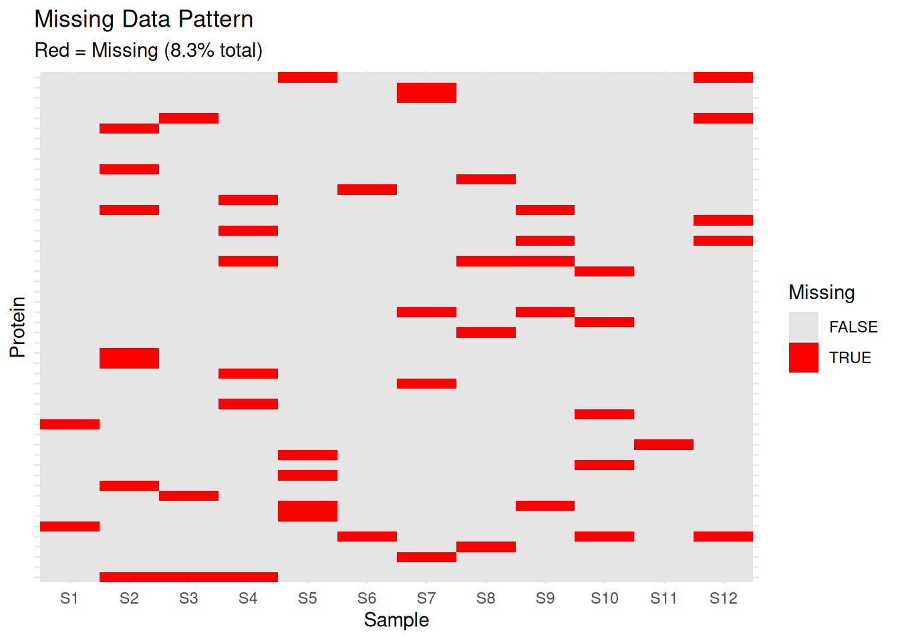
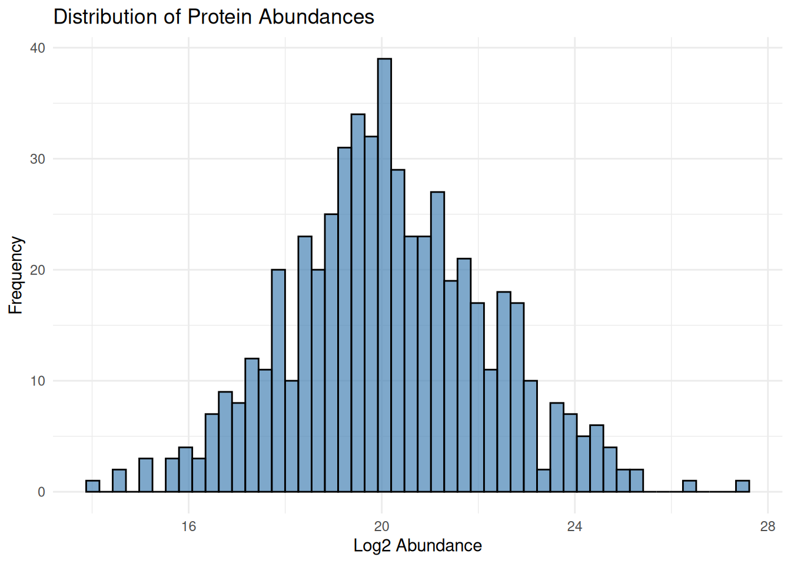

# Introduction to Proteomic Data & Quality Control {#day2}


## Learning Objectives

By the end of Day 2, you will be able to:

- Understand the structure of proteomic data matrices
- Identify common data quality issues
- Perform initial quality control checks
- Visualize data using PCA, boxplots, and heatmaps
- Conduct exploratory data analysis (EDA)

## Module 1: Introduction to Proteomic Data {#day2-mod1}

### From Mass Spectrometry to Quantified Proteins

Proteomics workflow:

1. **Sample Preparation**: Protein extraction, digestion into peptides
2. **LC-MS/MS**: Liquid chromatography coupled with tandem mass spectrometry
3. **Peptide Identification**: Match spectra to peptide sequences
4. **Protein Inference**: Aggregate peptides to proteins
5. **Quantification**: Measure protein abundance
   - Label-free quantification (LFQ)
   - Isobaric labeling (TMT, iTRAQ)
   - SILAC

### Structure of Proteomic Data Matrices

Typical structure: **Proteins × Samples**


``` r
# Example proteomic data structure
set.seed(42)

n_proteins <- 50
n_samples <- 12

# Create sample metadata
sample_metadata <- data.frame(
  sample_id = paste0("S", 1:n_samples),
  condition = rep(c("Control", "Treatment"), each = 6),
  batch = rep(c("Batch1", "Batch2"), times = 6),
  timepoint = rep(c("T0", "T1", "T2"), each = 4)
)

# Create protein matrix
protein_ids <- paste0("P", sprintf("%05d", 1:n_proteins))

# Simulate protein abundances with biological variation
protein_matrix <- matrix(
  rnorm(n_proteins * n_samples, mean = 20, sd = 2),
  nrow = n_proteins,
  ncol = n_samples,
  dimnames = list(protein_ids, sample_metadata$sample_id)
)

# Add treatment effect for some proteins
treatment_proteins <- 1:10
protein_matrix[treatment_proteins, 7:12] <- 
  protein_matrix[treatment_proteins, 7:12] + rnorm(10 * 6, mean = 2, sd = 0.5)

# Add some missing values (realistic scenario)
missing_indices <- sample(1:length(protein_matrix), size = 50)
protein_matrix[missing_indices] <- NA

# Display structure
cat("Matrix dimensions:", dim(protein_matrix), "\n")
#> Matrix dimensions: 50 12
cat("Number of proteins:", nrow(protein_matrix), "\n")
#> Number of proteins: 50
cat("Number of samples:", ncol(protein_matrix), "\n")
#> Number of samples: 12
cat("Number of missing values:", sum(is.na(protein_matrix)), "\n")
#> Number of missing values: 50

# Show first few rows and columns
head(protein_matrix[, 1:6])
#>              S1       S2       S3       S4       S5
#> P00001 22.74192       NA       NA       NA 15.99814
#> P00002 18.87060 18.43232 22.08950 16.89691 20.66755
#> P00003 20.72626 23.15146 17.99358 22.33434 22.34265
#> P00004 21.26573 21.28580 23.69696 19.45271 24.11908
#> P00005 20.80854 20.17952 18.66645 19.06431 17.24628
#> P00006       NA 20.55310 20.21103 17.52350 17.69829
#>              S6
#> P00001 17.80769
#> P00002 20.09810
#> P00003 17.60301
#> P00004 20.38004
#> P00005       NA
#> P00006 17.93225
```

### Understanding Your Data


``` r
# Sample metadata
print(sample_metadata)
#>    sample_id condition  batch timepoint
#> 1         S1   Control Batch1        T0
#> 2         S2   Control Batch2        T0
#> 3         S3   Control Batch1        T0
#> 4         S4   Control Batch2        T0
#> 5         S5   Control Batch1        T1
#> 6         S6   Control Batch2        T1
#> 7         S7 Treatment Batch1        T1
#> 8         S8 Treatment Batch2        T1
#> 9         S9 Treatment Batch1        T2
#> 10       S10 Treatment Batch2        T2
#> 11       S11 Treatment Batch1        T2
#> 12       S12 Treatment Batch2        T2

# Data summary
summary_stats <- data.frame(
  Sample = colnames(protein_matrix),
  Mean = apply(protein_matrix, 2, mean, na.rm = TRUE),
  Median = apply(protein_matrix, 2, median, na.rm = TRUE),
  SD = apply(protein_matrix, 2, sd, na.rm = TRUE),
  N_Missing = apply(protein_matrix, 2, function(x) sum(is.na(x)))
)

print(summary_stats)
#>     Sample     Mean   Median       SD N_Missing
#> S1      S1 19.90361 19.77202 2.343037         2
#> S2      S2 20.17817 20.51584 1.909604         7
#> S3      S3 19.57170 19.17226 1.828050         3
#> S4      S4 19.95178 20.21372 1.864843         6
#> S5      S5 20.18763 19.83178 1.987539         5
#> S6      S6 19.97424 20.09561 2.029430         2
#> S7      S7 20.22084 19.99952 1.864873         5
#> S8      S8 20.69754 20.46976 2.042691         4
#> S9      S9 20.32477 20.30522 2.090413         5
#> S10    S10 20.00961 19.98189 2.344816         5
#> S11    S11 20.65275 20.44848 2.322889         1
#> S12    S12 20.09191 19.97434 2.109793         5
```

### Exercise 2.1: Explore Your Data

Given a proteomic dataset, calculate:

1. Total number of proteins quantified
2. Average number of missing values per protein
3. Which sample has the most missing values?


```{.r .fold-hide}
# Solution
cat("1. Total proteins:", nrow(protein_matrix), "\n")
#> 1. Total proteins: 50

missing_per_protein <- apply(protein_matrix, 1, function(x) sum(is.na(x)))
cat("2. Average missing per protein:", 
    round(mean(missing_per_protein), 2), "\n")
#> 2. Average missing per protein: 1

missing_per_sample <- apply(protein_matrix, 2, function(x) sum(is.na(x)))
worst_sample <- names(which.max(missing_per_sample))
cat("3. Sample with most missing:", worst_sample, 
    "with", max(missing_per_sample), "missing values\n")
#> 3. Sample with most missing: S2 with 7 missing values
```

## Module 2: Initial Quality Control {#day2-mod2}

### Missing Data Analysis

Missing data is common in proteomics. Understanding the pattern is crucial.


``` r
# Calculate missingness
missing_per_protein <- apply(protein_matrix, 1, function(x) sum(is.na(x)))
missing_per_sample <- apply(protein_matrix, 2, function(x) sum(is.na(x)))

# Visualize missing data pattern
library(reshape2)

missing_df <- melt(is.na(protein_matrix))
colnames(missing_df) <- c("Protein", "Sample", "Missing")

# Plot missing data heatmap
ggplot(missing_df, aes(x = Sample, y = Protein, fill = Missing)) +
  geom_tile() +
  scale_fill_manual(values = c("TRUE" = "red", "FALSE" = "grey90")) +
  theme_minimal() +
  theme(axis.text.y = element_blank(),
        axis.ticks.y = element_blank()) +
  labs(title = "Missing Data Pattern",
       subtitle = paste0("Red = Missing (", 
                        round(mean(missing_df$Missing) * 100, 1), "% total)"))
```



``` r

# Histogram of missing values per protein
hist(missing_per_protein,
     breaks = 20,
     main = "Distribution of Missing Values per Protein",
     xlab = "Number of Missing Values",
     col = "steelblue")
```


### Detecting Outliers and Extreme Values


``` r
# Box plots for each sample
protein_df <- as.data.frame(protein_matrix)
protein_df$protein_id <- rownames(protein_df)

protein_long <- pivot_longer(protein_df, 
                             cols = -protein_id,
                             names_to = "sample_id",
                             values_to = "abundance")

# Add condition information
protein_long <- merge(protein_long, sample_metadata, by = "sample_id")

# Boxplot
ggplot(protein_long, aes(x = sample_id, y = abundance, fill = condition)) +
  geom_boxplot(outlier.size = 0.5) +
  theme_minimal() +
  theme(axis.text.x = element_text(angle = 45, hjust = 1)) +
  labs(title = "Abundance Distribution by Sample",
       x = "Sample", y = "Log2 Abundance") +
  scale_fill_brewer(palette = "Set2")
```


``` r

# Density plots
ggplot(protein_long, aes(x = abundance, color = sample_id)) +
  geom_density() +
  theme_minimal() +
  labs(title = "Density Plot of Protein Abundances",
       x = "Log2 Abundance", y = "Density") +
  theme(legend.position = "none")
```


### Batch Effects Detection

Batch effects are systematic non-biological variations.


``` r
# PCA colored by batch
pca_data <- t(na.omit(protein_matrix))
pca_result <- prcomp(pca_data, scale. = TRUE)

# Create PCA data frame
pca_df <- data.frame(
  PC1 = pca_result$x[, 1],
  PC2 = pca_result$x[, 2],
  sample_id = rownames(pca_result$x)
)

pca_df <- merge(pca_df, sample_metadata, by = "sample_id")

# Variance explained
var_explained <- summary(pca_result)$importance[2, 1:2] * 100

# PCA plot by batch
ggplot(pca_df, aes(x = PC1, y = PC2, color = batch, shape = condition)) +
  geom_point(size = 4) +
  theme_minimal() +
  labs(title = "PCA Analysis - Batch Effect Detection",
       x = paste0("PC1 (", round(var_explained[1], 1), "%)"),
       y = paste0("PC2 (", round(var_explained[2], 1), "%)")) +
  scale_color_brewer(palette = "Set1")
```


``` r

# PCA plot by condition
ggplot(pca_df, aes(x = PC1, y = PC2, color = condition, shape = batch)) +
  geom_point(size = 4) +
  theme_minimal() +
  labs(title = "PCA Analysis - Biological Conditions",
       x = paste0("PC1 (", round(var_explained[1], 1), "%)"),
       y = paste0("PC2 (", round(var_explained[2], 1), "%)")) +
  scale_color_brewer(palette = "Dark2")
```


### Sample Correlation Analysis


``` r
# Calculate sample correlations
cor_matrix <- cor(protein_matrix, use = "pairwise.complete.obs")

# Heatmap
rownames(sample_metadata) <- sample_metadata$sample_id

pheatmap(cor_matrix,
         annotation_col = sample_metadata[, c("condition", "batch"), drop = FALSE],
         annotation_row = sample_metadata[, c("condition", "batch"), drop = FALSE],
         main = "Sample-Sample Correlation",
         color = colorRampPalette(c("blue", "white", "red"))(50),
         breaks = seq(0.5, 1, length.out = 51))
```


### Exercise 2.2: Quality Control Checks

Perform QC on the provided dataset:

1. Calculate the percentage of proteins with >50% missing values
2. Identify if there are any outlier samples (median abundance far from others)
3. Check for batch effects using PCA


```{.r .fold-hide}
# Solution
# 1. Proteins with >50% missing
missing_pct <- apply(protein_matrix, 1, function(x) sum(is.na(x)) / length(x))
high_missing <- sum(missing_pct > 0.5)
cat("Proteins with >50% missing:", high_missing, 
    "(", round(high_missing / nrow(protein_matrix) * 100, 1), "%)\n")
#> Proteins with >50% missing: 0 ( 0 %)

# 2. Outlier samples based on median
sample_medians <- apply(protein_matrix, 2, median, na.rm = TRUE)
median_overall <- median(sample_medians)
mad_overall <- mad(sample_medians)
outliers <- abs(sample_medians - median_overall) > 3 * mad_overall

if (any(outliers)) {
  cat("Outlier samples:", names(sample_medians)[outliers], "\n")
} else {
  cat("No outlier samples detected\n")
}
#> No outlier samples detected

# 3. Batch effects - already shown in PCA above
cat("Check PCA plot above for batch effect visualization\n")
#> Check PCA plot above for batch effect visualization
```

## Module 3: Exploratory Data Analysis (EDA) {#day2-mod3}

### Distribution of Intensities


``` r
# Histogram of all values
ggplot(protein_long, aes(x = abundance)) +
  geom_histogram(bins = 50, fill = "steelblue", color = "black", alpha = 0.7) +
  theme_minimal() +
  labs(title = "Distribution of Protein Abundances",
       x = "Log2 Abundance", y = "Frequency")
```



``` r

# Violin plots by condition
ggplot(protein_long, aes(x = condition, y = abundance, fill = condition)) +
  geom_violin() +
  geom_boxplot(width = 0.1, fill = "white", outlier.size = 0.5) +
  theme_minimal() +
  labs(title = "Abundance Distribution by Condition",
       x = "Condition", y = "Log2 Abundance") +
  scale_fill_brewer(palette = "Set2")
```


### Hierarchical Clustering


``` r
# Remove proteins with too many missing values
complete_proteins <- rowSums(is.na(protein_matrix)) < ncol(protein_matrix) * 0.3
filtered_matrix <- protein_matrix[complete_proteins, ]

# Impute remaining missing values with row means
for (i in 1:nrow(filtered_matrix)) {
  missing_idx <- is.na(filtered_matrix[i, ])
  if (any(missing_idx)) {
    filtered_matrix[i, missing_idx] <- mean(filtered_matrix[i, ], na.rm = TRUE)
  }
}

# Hierarchical clustering heatmap
annotation_col <- sample_metadata[, c("condition", "batch", "timepoint")]
rownames(annotation_col) <- sample_metadata$sample_id

pheatmap(filtered_matrix,
         scale = "row",
         clustering_distance_rows = "euclidean",
         clustering_distance_cols = "euclidean",
         annotation_col = annotation_col,
         show_rownames = FALSE,
         main = "Hierarchical Clustering of Samples",
         color = colorRampPalette(c("blue", "white", "red"))(50))
```


### Sample Similarity Analysis


``` r
# Calculate Euclidean distances between samples
sample_dist <- dist(t(filtered_matrix))
sample_dist_matrix <- as.matrix(sample_dist)

# Heatmap of distances
pheatmap(sample_dist_matrix,
         annotation_col = annotation_col,
         annotation_row = annotation_col,
         main = "Sample-Sample Distance Matrix",
         color = colorRampPalette(c("red", "white"))(50))
```


``` r

# MDS plot (alternative to PCA)
mds_result <- cmdscale(sample_dist, k = 2)
mds_df <- data.frame(
  MDS1 = mds_result[, 1],
  MDS2 = mds_result[, 2],
  sample_id = colnames(filtered_matrix)
)
mds_df <- merge(mds_df, sample_metadata, by = "sample_id")

ggplot(mds_df, aes(x = MDS1, y = MDS2, color = condition, shape = batch)) +
  geom_point(size = 4) +
  theme_minimal() +
  labs(title = "MDS Plot of Sample Similarity",
       x = "MDS Dimension 1", y = "MDS Dimension 2") +
  scale_color_brewer(palette = "Dark2")
```


### Coefficient of Variation Analysis


``` r
# Calculate CV for each protein
calculate_cv <- function(x) {
  (sd(x, na.rm = TRUE) / mean(x, na.rm = TRUE)) * 100
}

cv_by_condition <- protein_long %>%
  group_by(protein_id, condition) %>%
  summarise(cv = calculate_cv(abundance), .groups = "drop")

# Plot CV distribution
ggplot(cv_by_condition, aes(x = cv, fill = condition)) +
  geom_histogram(bins = 30, alpha = 0.7, position = "identity") +
  theme_minimal() +
  labs(title = "Coefficient of Variation Distribution",
       x = "CV (%)", y = "Count") +
  scale_fill_brewer(palette = "Set2") +
  facet_wrap(~ condition, ncol = 1)
```


``` r

# Summary statistics
cv_summary <- cv_by_condition %>%
  group_by(condition) %>%
  summarise(
    mean_cv = mean(cv, na.rm = TRUE),
    median_cv = median(cv, na.rm = TRUE),
    sd_cv = sd(cv, na.rm = TRUE)
  )

print(cv_summary)
#> # A tibble: 2 × 4
#>   condition mean_cv median_cv sd_cv
#>   <chr>       <dbl>     <dbl> <dbl>
#> 1 Control      9.63      8.85  3.33
#> 2 Treatment    8.93      8.64  3.37
```

### Exercise 2.3: Complete EDA

Perform a complete exploratory analysis:

1. Create a report summarizing data quality
2. Identify the top 10 most variable proteins
3. Check if samples cluster by biological condition


```{.r .fold-hide}
# Solution
# 1. Data quality report
cat("=== DATA QUALITY REPORT ===\n\n")
#> === DATA QUALITY REPORT ===
cat("Dataset dimensions:", nrow(protein_matrix), "proteins x", 
    ncol(protein_matrix), "samples\n")
#> Dataset dimensions: 50 proteins x 12 samples
cat("Total missing values:", sum(is.na(protein_matrix)), 
    "(", round(mean(is.na(protein_matrix)) * 100, 1), "%)\n")
#> Total missing values: 50 ( 8.3 %)
cat("Samples:", paste(sample_metadata$sample_id, collapse = ", "), "\n")
#> Samples: S1, S2, S3, S4, S5, S6, S7, S8, S9, S10, S11, S12
cat("Conditions:", paste(unique(sample_metadata$condition), collapse = ", "), "\n")
#> Conditions: Control, Treatment
cat("Batches:", paste(unique(sample_metadata$batch), collapse = ", "), "\n\n")
#> Batches: Batch1, Batch2

# 2. Top 10 most variable proteins
protein_variance <- apply(filtered_matrix, 1, var, na.rm = TRUE)
top10_variable <- names(sort(protein_variance, decreasing = TRUE)[1:10])
cat("Top 10 most variable proteins:\n")
#> Top 10 most variable proteins:
print(top10_variable)
#>  [1] "P00009" "P00018" "P00001" "P00019" "P00024" "P00044"
#>  [7] "P00016" "P00025" "P00017" "P00031"

# Plot top variable proteins
top10_data <- protein_long %>%
  filter(protein_id %in% top10_variable)

ggplot(top10_data, aes(x = sample_id, y = abundance, color = condition, group = 1)) +
  geom_line() +
  geom_point() +
  facet_wrap(~ protein_id, scales = "free_y", ncol = 2) +
  theme_minimal() +
  theme(axis.text.x = element_text(angle = 45, hjust = 1)) +
  labs(title = "Top 10 Most Variable Proteins", x = "Sample", y = "Abundance")
```


```{.r .fold-hide}

# 3. Clustering by condition
cat("\n3. Checking sample clustering by condition:\n")
#> 
#> 3. Checking sample clustering by condition:
cat("Review the PCA and hierarchical clustering plots above.\n")
#> Review the PCA and hierarchical clustering plots above.
cat("Samples should cluster primarily by condition if biological signal is strong.\n")
#> Samples should cluster primarily by condition if biological signal is strong.
```

## Creating Quality Control Reports


``` r
# Function to generate QC report
generate_qc_report <- function(data_matrix, metadata) {
  report <- list()
  
  # Basic statistics
  report$n_proteins <- nrow(data_matrix)
  report$n_samples <- ncol(data_matrix)
  report$missing_pct <- mean(is.na(data_matrix)) * 100
  
  # Sample statistics
  report$sample_stats <- data.frame(
    Sample = colnames(data_matrix),
    N_Quantified = colSums(!is.na(data_matrix)),
    Median_Abundance = apply(data_matrix, 2, median, na.rm = TRUE),
    Mean_Abundance = apply(data_matrix, 2, mean, na.rm = TRUE),
    SD_Abundance = apply(data_matrix, 2, sd, na.rm = TRUE)
  )
  
  # Protein statistics
  report$protein_stats <- data.frame(
    N_Complete = sum(rowSums(is.na(data_matrix)) == 0),
    N_Partial = sum(rowSums(is.na(data_matrix)) > 0 & rowSums(is.na(data_matrix)) < ncol(data_matrix)),
    N_Mostly_Missing = sum(rowSums(is.na(data_matrix)) > ncol(data_matrix) * 0.5)
  )
  
  return(report)
}

# Generate report
qc_report <- generate_qc_report(protein_matrix, sample_metadata)

# Print report
cat("=== QUALITY CONTROL SUMMARY ===\n\n")
#> === QUALITY CONTROL SUMMARY ===
cat("Total Proteins:", qc_report$n_proteins, "\n")
#> Total Proteins: 50
cat("Total Samples:", qc_report$n_samples, "\n")
#> Total Samples: 12
cat("Missing Data:", round(qc_report$missing_pct, 2), "%\n\n")
#> Missing Data: 8.33 %

cat("Protein Completeness:\n")
#> Protein Completeness:
cat("  Complete (no missing):", qc_report$protein_stats$N_Complete, "\n")
#>   Complete (no missing): 12
cat("  Partial missing:", qc_report$protein_stats$N_Partial, "\n")
#>   Partial missing: 38
cat("  Mostly missing (>50%):", qc_report$protein_stats$N_Mostly_Missing, "\n\n")
#>   Mostly missing (>50%): 0

print(qc_report$sample_stats)
#>     Sample N_Quantified Median_Abundance Mean_Abundance
#> S1      S1           48         19.77202       19.90361
#> S2      S2           43         20.51584       20.17817
#> S3      S3           47         19.17226       19.57170
#> S4      S4           44         20.21372       19.95178
#> S5      S5           45         19.83178       20.18763
#> S6      S6           48         20.09561       19.97424
#> S7      S7           45         19.99952       20.22084
#> S8      S8           46         20.46976       20.69754
#> S9      S9           45         20.30522       20.32477
#> S10    S10           45         19.98189       20.00961
#> S11    S11           49         20.44848       20.65275
#> S12    S12           45         19.97434       20.09191
#>     SD_Abundance
#> S1      2.343037
#> S2      1.909604
#> S3      1.828050
#> S4      1.864843
#> S5      1.987539
#> S6      2.029430
#> S7      1.864873
#> S8      2.042691
#> S9      2.090413
#> S10     2.344816
#> S11     2.322889
#> S12     2.109793
```

## Day 2 Summary

Today you learned:

- ✓ Structure of proteomic data matrices
- ✓ Common data quality issues (missing values, outliers, batch effects)
- ✓ Quality control visualization techniques
- ✓ Exploratory data analysis methods
- ✓ Sample correlation and clustering

### Key Takeaways

1. **Missing data** is common in proteomics - understand the pattern before imputation
2. **Batch effects** can confound biological signals - always check with PCA
3. **Quality control** should be performed before any statistical analysis
4. **Visualization** is essential for understanding your data

### Homework

1. Apply QC pipeline to a new dataset
2. Practice identifying batch effects
3. Create custom QC visualizations


``` r
# Prepare for Day 3
install.packages(c("preprocessCore", "matrixStats"))

BiocManager::install(c("limma", "vsn", "sva"))
```

## Additional Resources

- [Proteomics Data Analysis Best Practices](https://www.nature.com/articles/nmeth.3901)
- [Understanding PCA in Proteomics](https://www.mcponline.org/)
- Kammers et al. (2015) "Detecting Significant Changes in Protein Abundance"

## Case Study: Real Proteomic Dataset


``` r
# Example workflow for your own data
# 1. Load data
my_data <- read.csv("your_protein_data.csv", row.names = 1)

# 2. Load metadata
my_metadata <- read.csv("your_sample_metadata.csv")

# 3. Initial QC
qc_report <- generate_qc_report(my_data, my_metadata)

# 4. Visualizations
# - PCA
# - Correlation heatmap
# - Missing data pattern
# - Boxplots

# 5. Document findings
# - Any problematic samples?
# - Batch effects present?
# - Next steps for preprocessing
```


