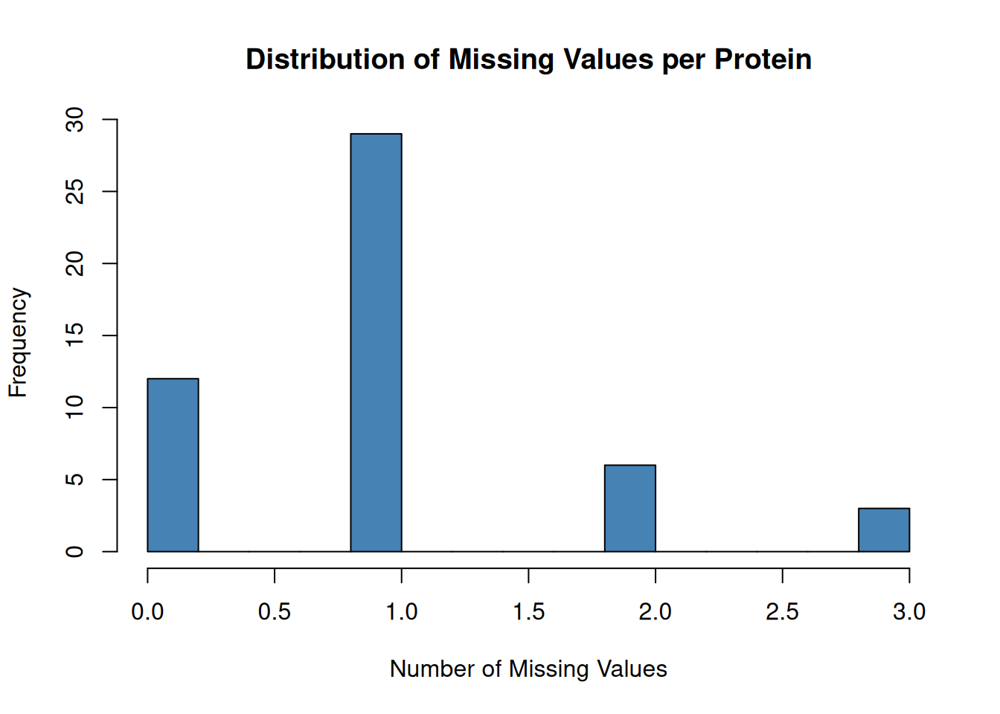
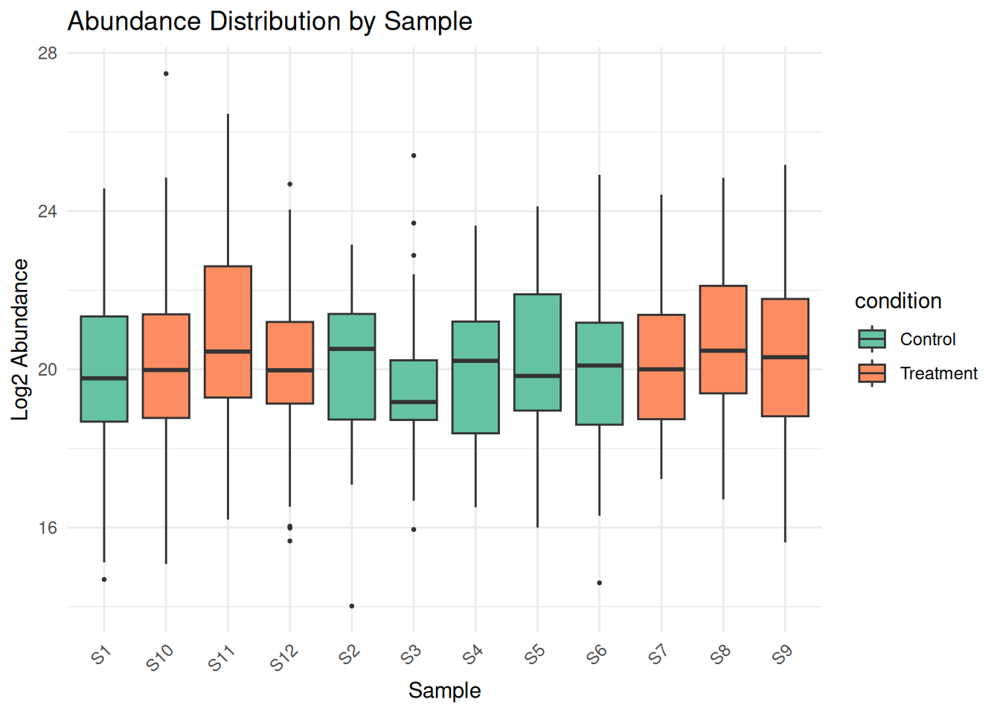
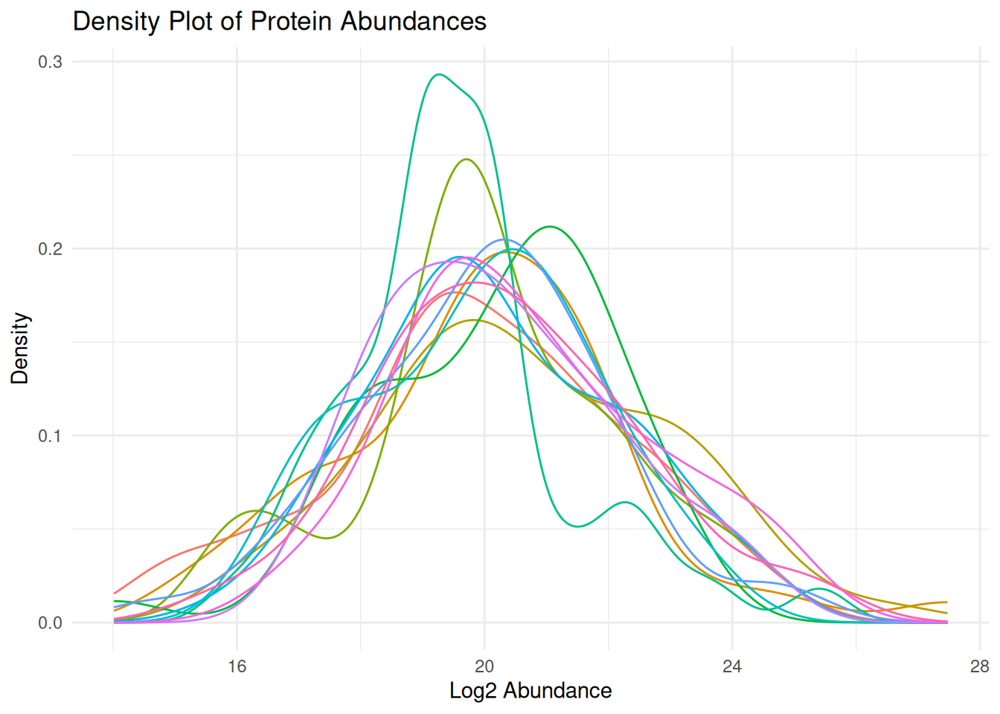
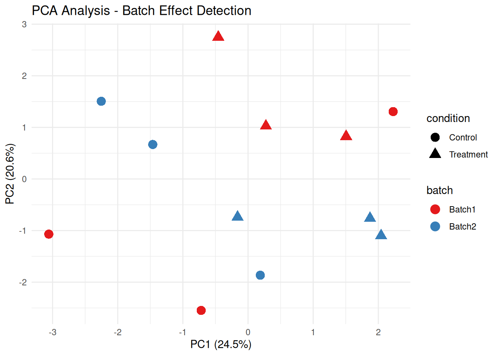
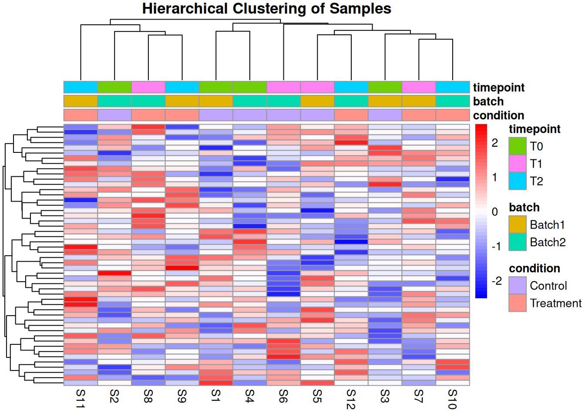
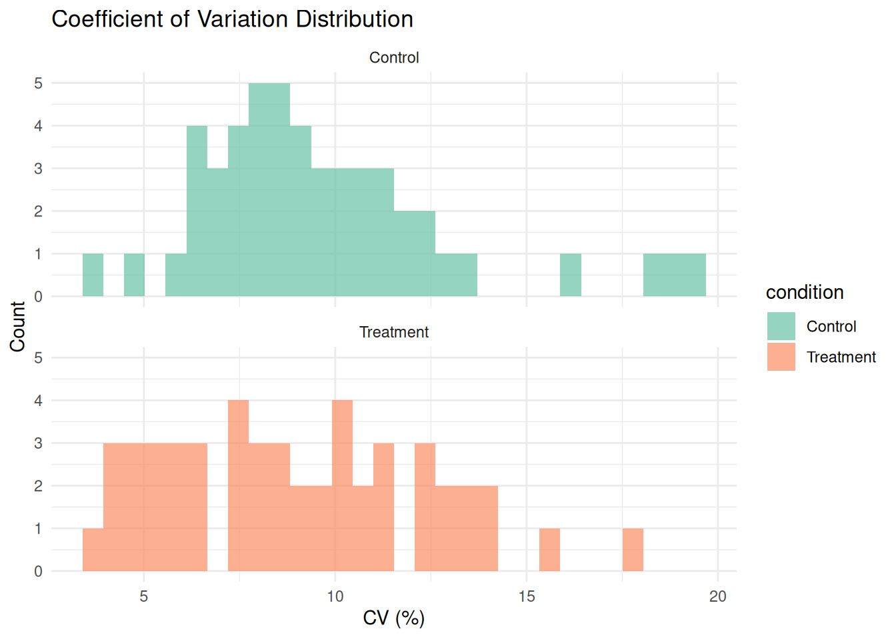
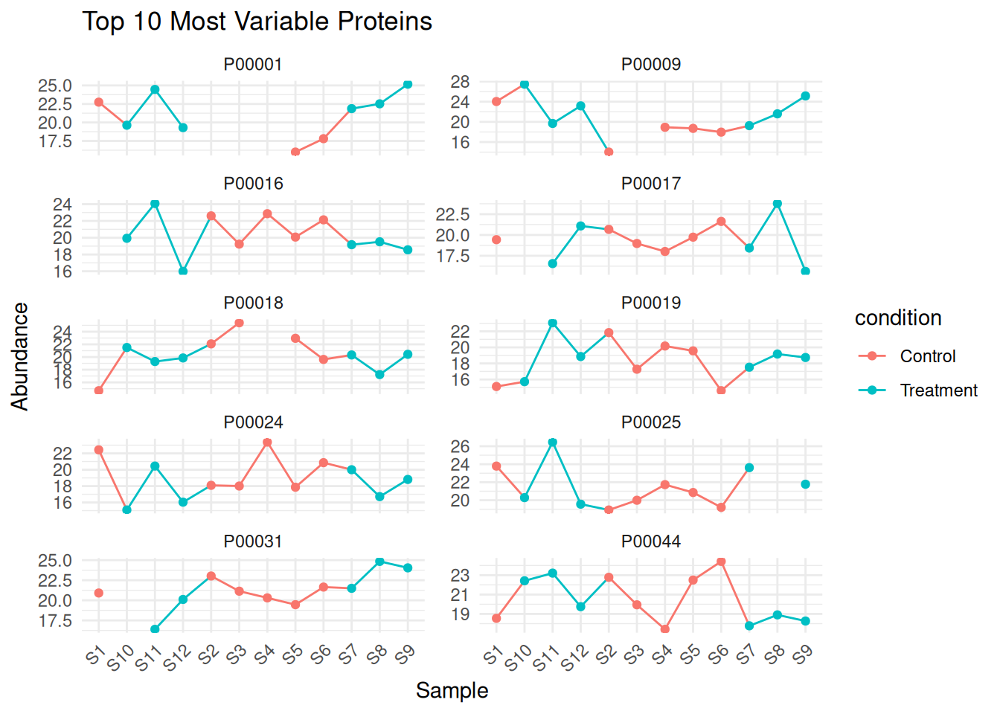

# Introduction to Proteomic Data & Quality Control {#day2}


## Learning Objectives

By the end of Day 2, you will be able to:

- Understand the structure of proteomic data matrices
- Identify common data quality issues
- Perform initial quality control checks
- Visualize data using PCA, boxplots, and heatmaps
- Conduct exploratory data analysis (EDA)

## Module 1: Introduction to Proteomic Data {#day2-mod1}

### From Mass Spectrometry to Quantified Proteins

Proteomics workflow:

1. **Sample Preparation**: Protein extraction, digestion into peptides
2. **LC-MS/MS**: Liquid chromatography coupled with tandem mass spectrometry
3. **Peptide Identification**: Match spectra to peptide sequences
4. **Protein Inference**: Aggregate peptides to proteins
5. **Quantification**: Measure protein abundance
   - Label-free quantification (LFQ)
   - Isobaric labeling (TMT, iTRAQ)
   - SILAC

### Structure of Proteomic Data Matrices

Typical structure: **Proteins × Samples**

Each row corresponds to a quantified protein (or protein group), 
and each column corresponds to a biological or technical sample. 
Additional annotation tables typically accompany the intensity matrix 
to describe samples (metadata) and proteins.


``` r
## The simulated dataset used throughout this course can be downloaded from:
## https://github.com/lodiag-holocron/r4proteomics/data
## After downloading, save the files in your working directory or adjust the path below.

# Load the data components
protein_matrix <- read.csv("data/protein_matrix.csv", row.names = 1, 
                           check.names = FALSE) # Proteins × Samples
sample_metadata <- read.csv("data/sample_metadata.csv")
protein_annotations <- read.csv("data/protein_annotations.csv")

cat("Matrix dimensions:", dim(protein_matrix), "\n")
#> Matrix dimensions: 1500 24
cat("Number of proteins:", nrow(protein_matrix), "\n")
#> Number of proteins: 1500
cat("Number of samples:", ncol(protein_matrix), "\n")
#> Number of samples: 24
cat("Number of missing values:", sum(is.na(protein_matrix)), "\n")
#> Number of missing values: 6129

head(protein_matrix[, 1:6])
#>             S01      S02      S03      S04      S05
#> P00001 19.35480 18.96313 19.06881 18.40190 19.07950
#> P00002       NA 20.12900 19.50040 20.46297 19.27021
#> P00003 20.52426 20.73074 20.38798       NA 20.87123
#> P00004 19.22324 20.08649 19.42952 20.19402 19.65949
#> P00005 19.07521 18.09634 19.13851 19.48897 19.53155
#> P00006 19.35648 18.63925 18.56821 18.90192 19.05903
#>             S06
#> P00001 18.86255
#> P00002 20.42601
#> P00003 20.43996
#> P00004 20.42104
#> P00005 19.26485
#> P00006 17.85950
```

### Understanding Your Data

Before performing any downstream analysis, it is essential to explore
both the sample metadata and the distribution of protein intensities 
across samples. This provides insights into sample composition, 
missing value patterns, and potential sources of technical or 
biological variation.


``` r
print(sample_metadata)
#>    sample_id condition  batch timepoint patient_id sex age
#> 1        S01   Control Batch1     Week0          1   M  46
#> 2        S02   Control Batch1     Week0          2   M  43
#> 3        S03   Control Batch1     Week0          3   M  64
#> 4        S04   Control Batch1     Week0          4   M  44
#> 5        S05   Control Batch1     Week4          5   F  53
#> 6        S06   Control Batch1     Week4          6   F  59
#> 7        S07   Control Batch1     Week4          7   F  65
#> 8        S08   Control Batch1     Week4          8   F  57
#> 9        S09   Control Batch2     Week8          9   M  54
#> 10       S10   Control Batch2     Week8         10   F  42
#> 11       S11   Control Batch2     Week8         11   M  48
#> 12       S12   Control Batch2     Week8         12   F  64
#> 13       S13 Treatment Batch2     Week0          1   M  46
#> 14       S14 Treatment Batch2     Week0          2   M  43
#> 15       S15 Treatment Batch2     Week0          3   M  64
#> 16       S16 Treatment Batch2     Week0          4   M  44
#> 17       S17 Treatment Batch3     Week4          5   F  53
#> 18       S18 Treatment Batch3     Week4          6   F  59
#> 19       S19 Treatment Batch3     Week4          7   F  65
#> 20       S20 Treatment Batch3     Week4          8   F  57
#> 21       S21 Treatment Batch3     Week8          9   M  54
#> 22       S22 Treatment Batch3     Week8         10   F  42
#> 23       S23 Treatment Batch3     Week8         11   M  48
#> 24       S24 Treatment Batch3     Week8         12   F  64

summary_stats <- data.frame(
  Sample = colnames(protein_matrix),
  Mean = apply(protein_matrix, 2, mean, na.rm = TRUE),
  Median = apply(protein_matrix, 2, median, na.rm = TRUE),
  SD = apply(protein_matrix, 2, sd, na.rm = TRUE),
  N_Missing = apply(protein_matrix, 2, function(x) sum(is.na(x)))
)

cat("\nSummary statistics for protein intensities (per sample):\n")
#> 
#> Summary statistics for protein intensities (per sample):
print(summary_stats)
#>     Sample     Mean   Median        SD N_Missing
#> S01    S01 19.44315 19.50776 0.6422235       246
#> S02    S02 19.45776 19.54125 0.6763063       279
#> S03    S03 19.46639 19.52765 0.6669170       248
#> S04    S04 19.44903 19.53626 0.6724402       264
#> S05    S05 19.58690 19.65949 0.6711332       247
#> S06    S06 19.59335 19.68316 0.6730298       269
#> S07    S07 19.58116 19.66875 0.6726562       245
#> S08    S08 19.60911 19.69826 0.6710727       239
#> S09    S09 20.04367 20.14614 0.6764492       239
#> S10    S10 20.02065 20.08802 0.6780620       243
#> S11    S11 20.06717 20.13104 0.6586759       253
#> S12    S12 20.05050 20.15002 0.6916134       262
#> S13    S13 19.92555 19.96241 0.8610616       252
#> S14    S14 19.92434 19.95156 0.8699636       259
#> S15    S15 19.92678 19.94447 0.8564935       261
#> S16    S16 19.92355 19.93563 0.8547909       261
#> S17    S17 20.43031 20.43232 0.8736235       271
#> S18    S18 20.43452 20.47541 0.8512421       270
#> S19    S19 20.43624 20.47908 0.8566041       249
#> S20    S20 20.44267 20.46627 0.8982385       245
#> S21    S21 20.56463 20.59117 0.8634333       273
#> S22    S22 20.56406 20.58383 0.8675018       250
#> S23    S23 20.54699 20.55144 0.8678363       251
#> S24    S24 20.55525 20.56910 0.8498352       253
```

### Exercise 2.1: Explore Your Data

Given a proteomic dataset, calculate:

1. Total number of proteins quantified
2. Average number of missing values per protein
3. Which sample has the most missing values?


```{.r .fold-hide}
# Solution
cat("1. Total proteins:", nrow(protein_matrix), "\n")
#> 1. Total proteins: 1500

missing_per_protein <- apply(protein_matrix, 1, function(x) sum(is.na(x)))
cat("2. Average missing per protein:", 
    round(mean(missing_per_protein), 2), "\n")
#> 2. Average missing per protein: 4.09

missing_per_sample <- apply(protein_matrix, 2, function(x) sum(is.na(x)))
worst_sample <- names(which.max(missing_per_sample))
cat("3. Sample with most missing:", worst_sample, 
    "with", max(missing_per_sample), "missing values\n")
#> 3. Sample with most missing: S02 with 279 missing values
```

## Module 2: Initial Quality Control {#day2-mod2}

### Missing Data Analysis

Missing data is common in proteomics. Understanding the pattern is crucial. 

Understanding how much data is missing and where it occurs is 
an essential first step in quality control, as missingness can reflect 
low-abundance proteins, stochastic sampling, or technical artifacts.


``` r
# Calculate missingness
missing_per_protein <- apply(protein_matrix, 1, function(x) sum(is.na(x)))
missing_per_sample <- apply(protein_matrix, 2, function(x) sum(is.na(x)))

# Visualize missing data pattern
library(reshape2)

missing_df <- melt(is.na(protein_matrix))
colnames(missing_df) <- c("Protein", "Sample", "Missing")

# Plot missing data heatmap
ggplot(missing_df, aes(x = Sample, y = Protein, fill = Missing)) +
  geom_tile() +
  scale_fill_manual(values = c("TRUE" = "red", "FALSE" = "grey90")) +
  theme_minimal() +
  theme(axis.text.y = element_blank(),
        axis.ticks.y = element_blank()) +
  labs(title = "Missing Data Pattern",
       subtitle = paste0("Red = Missing (", 
                        round(mean(missing_df$Missing) * 100, 1), "% total)"))
```


``` r

# Histogram of missing values per protein
hist(missing_per_protein,
     breaks = 20,
     main = "Distribution of Missing Values per Protein",
     xlab = "Number of Missing Values",
     col = "steelblue")
```



### Detecting Outliers and Extreme Values

Visual inspection of abundance distributions helps identify outlier 
samples, intensity shifts, and potential batch effects. Boxplots and 
density plots provide complementary views of the overall data structure.


``` r
# Box plots for each sample
protein_df <- as.data.frame(protein_matrix)
protein_df$protein_id <- rownames(protein_df)

protein_long <- pivot_longer(protein_df, 
                             cols = -protein_id,
                             names_to = "sample_id",
                             values_to = "abundance")

# Add condition information
protein_long <- merge(protein_long, sample_metadata, by = "sample_id")

# Boxplot
ggplot(protein_long, aes(x = sample_id, y = abundance, fill = condition)) +
  geom_boxplot(outlier.size = 0.5) +
  theme_minimal() +
  theme(axis.text.x = element_text(angle = 45, hjust = 1)) +
  labs(title = "Abundance Distribution by Sample",
       x = "Sample", y = "Log2 Abundance") +
  scale_fill_brewer(palette = "Set2")
```



``` r

# Density plots
ggplot(protein_long, aes(x = abundance, color = sample_id)) +
  geom_density() +
  theme_minimal() +
  labs(title = "Density Plot of Protein Abundances",
       x = "Log2 Abundance", y = "Density") +
  theme(legend.position = "none")
```



### Batch Effects Detection

Batch effects are systematic non-biological variations.
They can be introduced during sample preparation, instrument runs, 
or other technical steps. 

Principal Component Analysis (PCA) is a powerful tool to detect 
such effects by projecting high-dimensional data into lower-dimensional 
space and highlighting clustering patterns.


``` r
# PCA colored by batch
pca_data <- t(na.omit(protein_matrix))
pca_result <- prcomp(pca_data, scale. = TRUE)

# Create PCA data frame
pca_df <- data.frame(
  PC1 = pca_result$x[, 1],
  PC2 = pca_result$x[, 2],
  sample_id = rownames(pca_result$x)
)

pca_df <- merge(pca_df, sample_metadata, by = "sample_id")

# Variance explained
var_explained <- summary(pca_result)$importance[2, 1:2] * 100

# PCA plot by batch
ggplot(pca_df, aes(x = PC1, y = PC2, color = batch, shape = condition)) +
  geom_point(size = 4) +
  theme_minimal() +
  labs(title = "PCA Analysis - Batch Effect Detection",
       x = paste0("PC1 (", round(var_explained[1], 1), "%)"),
       y = paste0("PC2 (", round(var_explained[2], 1), "%)")) +
  scale_color_brewer(palette = "Set1")
```



``` r

# PCA plot by condition
ggplot(pca_df, aes(x = PC1, y = PC2, color = condition, shape = batch)) +
  geom_point(size = 4) +
  theme_minimal() +
  labs(title = "PCA Analysis - Biological Conditions",
       x = paste0("PC1 (", round(var_explained[1], 1), "%)"),
       y = paste0("PC2 (", round(var_explained[2], 1), "%)")) +
  scale_color_brewer(palette = "Dark2")
```


### Sample Correlation Analysis

Correlation analysis provides a global overview of sample similarity 
based on protein abundance profiles.

High correlation typically indicates consistent quantification 
across samples, while lower correlations may highlight outliers, 
batch effects, or technical artifacts. Heatmaps combined with metadata 
annotations offer an intuitive way to inspect these relationships.


``` r
# Calculate sample correlations
cor_matrix <- cor(protein_matrix, use = "pairwise.complete.obs")

# Heatmap
rownames(sample_metadata) <- sample_metadata$sample_id

pheatmap(cor_matrix,
         annotation_col = sample_metadata[, c("condition", "batch"), drop = FALSE],
         annotation_row = sample_metadata[, c("condition", "batch"), drop = FALSE],
         main = "Sample-Sample Correlation",
         color = colorRampPalette(c("blue", "white", "red"))(50),
         breaks = seq(0.5, 1, length.out = 51))
```


### Exercise 2.2: Quality Control Checks

Perform QC on the provided dataset:

1. Calculate the percentage of proteins with >50% missing values
2. Identify if there are any outlier samples (median abundance far from others)
3. Check for batch effects using PCA


```{.r .fold-hide}
# Solution
# 1. Proteins with >50% missing
missing_pct <- apply(protein_matrix, 1, function(x) sum(is.na(x)) / length(x))
high_missing <- sum(missing_pct > 0.5)
cat("Proteins with >50% missing:", high_missing, 
    "(", round(high_missing / nrow(protein_matrix) * 100, 1), "%)\n")
#> Proteins with >50% missing: 76 ( 5.1 %)

# 2. Outlier samples based on median
sample_medians <- apply(protein_matrix, 2, median, na.rm = TRUE)
median_overall <- median(sample_medians)
mad_overall <- mad(sample_medians)
outliers <- abs(sample_medians - median_overall) > 3 * mad_overall

if (any(outliers)) {
  cat("Outlier samples:", names(sample_medians)[outliers], "\n")
} else {
  cat("No outlier samples detected\n")
}
#> No outlier samples detected

# 3. Batch effects - already shown in PCA above
cat("Check PCA plot above for batch effect visualization\n")
#> Check PCA plot above for batch effect visualization
```

## Module 3: Exploratory Data Analysis (EDA) {#day2-mod3}

### Distribution of Intensities

Examining the distribution of protein abundances helps identify global
trends, skewness, or technical artifacts in the dataset.

Both histograms and violin plots provide complementary perspectives on
the overall intensity patterns.


``` r
# Histogram of all values
ggplot(protein_long, aes(x = abundance)) +
  geom_histogram(bins = 50, fill = "steelblue", color = "black", alpha = 0.7) +
  theme_minimal() +
  labs(title = "Distribution of Protein Abundances",
       x = "Log2 Abundance", y = "Frequency")
```


``` r

# Violin plots by condition
ggplot(protein_long, aes(x = condition, y = abundance, fill = condition)) +
  geom_violin() +
  geom_boxplot(width = 0.1, fill = "white", outlier.size = 0.5) +
  theme_minimal() +
  labs(title = "Abundance Distribution by Condition",
       x = "Condition", y = "Log2 Abundance") +
  scale_fill_brewer(palette = "Set2")
```


### Hierarchical Clustering

Hierarchical clustering groups samples or proteins based on similarity
in abundance profiles.

This approach helps identify natural clusters, outliers, or 
batch-related patterns in the data.


``` r
# Remove proteins with too many missing values
complete_proteins <- rowSums(is.na(protein_matrix)) < ncol(protein_matrix) * 0.3
filtered_matrix <- protein_matrix[complete_proteins, ]

# Impute remaining missing values with row means
for (i in 1:nrow(filtered_matrix)) {
  missing_idx <- is.na(filtered_matrix[i, ])
  if (any(missing_idx)) {
    filtered_matrix[i, missing_idx] <- mean(filtered_matrix[i, ], na.rm = TRUE)
  }
}

# Hierarchical clustering heatmap
annotation_col <- sample_metadata[, c("condition", "batch", "timepoint")]
rownames(annotation_col) <- sample_metadata$sample_id

pheatmap(filtered_matrix,
         scale = "row",
         clustering_distance_rows = "euclidean",
         clustering_distance_cols = "euclidean",
         annotation_col = annotation_col,
         show_rownames = FALSE,
         main = "Hierarchical Clustering of Samples",
         color = colorRampPalette(c("blue", "white", "red"))(50))
```



### Sample Similarity Analysis

Assessing sample similarity helps detect outliers, batch effects, 
or unexpected clustering among samples.

Euclidean distances and multidimensional scaling (MDS) provide 
additional overview of global relationships between samples.


``` r
# Calculate Euclidean distances between samples
sample_dist <- dist(t(filtered_matrix))
sample_dist_matrix <- as.matrix(sample_dist)

# Heatmap of distances
pheatmap(sample_dist_matrix,
         annotation_col = annotation_col,
         annotation_row = annotation_col,
         main = "Sample-Sample Distance Matrix",
         color = colorRampPalette(c("red", "white"))(10))
```


``` r

# MDS plot (alternative to PCA)
mds_result <- cmdscale(sample_dist, k = 2)
mds_df <- data.frame(
  MDS1 = mds_result[, 1],
  MDS2 = mds_result[, 2],
  sample_id = colnames(filtered_matrix)
)
mds_df <- merge(mds_df, sample_metadata, by = "sample_id")

ggplot(mds_df, aes(x = MDS1, y = MDS2, color = condition, shape = batch)) +
  geom_point(size = 4) +
  theme_minimal() +
  labs(title = "MDS Plot of Sample Similarity",
       x = "MDS Dimension 1", y = "MDS Dimension 2") +
  scale_color_brewer(palette = "Dark2")
```


### Coefficient of Variation Analysis

The coefficient of variation (CV) quantifies relative variability 
in protein abundances across samples.

High CV values may indicate technical variability or highly dynamic
proteins, while low CV suggests stable proteins.


``` r
# Calculate CV for each protein
calculate_cv <- function(x) {
  (sd(x, na.rm = TRUE) / mean(x, na.rm = TRUE)) * 100
}

cv_by_condition <- protein_long %>%
  group_by(protein_id, condition) %>%
  summarise(cv = calculate_cv(abundance), .groups = "drop")

# Plot CV distribution
ggplot(cv_by_condition, aes(x = cv, fill = condition)) +
  geom_histogram(bins = 30, alpha = 0.7, position = "identity") +
  theme_minimal() +
  labs(title = "Coefficient of Variation Distribution",
       x = "CV (%)", y = "Count") +
  scale_fill_brewer(palette = "Set2") +
  facet_wrap(~ condition, ncol = 1)
```



``` r

# Summary statistics
cv_summary <- cv_by_condition %>%
  group_by(condition) %>%
  summarise(
    mean_cv = mean(cv, na.rm = TRUE),
    median_cv = median(cv, na.rm = TRUE),
    sd_cv = sd(cv, na.rm = TRUE)
  )

print(cv_summary)
#> # A tibble: 2 × 4
#>   condition mean_cv median_cv sd_cv
#>   <chr>       <dbl>     <dbl> <dbl>
#> 1 Control      2.36      2.29 0.637
#> 2 Treatment    2.33      2.27 0.622
```

### Exercise 2.3: Complete EDA

Perform a complete exploratory analysis:

1. Create a report summarizing data quality
2. Identify the top 10 most variable proteins
3. Check if samples cluster by biological condition


```{.r .fold-hide}
# Solution
# 1. Data quality report
cat("=== DATA QUALITY REPORT ===\n\n")
#> === DATA QUALITY REPORT ===
cat("Dataset dimensions:", nrow(protein_matrix), "proteins x", 
    ncol(protein_matrix), "samples\n")
#> Dataset dimensions: 1500 proteins x 24 samples
cat("Total missing values:", sum(is.na(protein_matrix)), 
    "(", round(mean(is.na(protein_matrix)) * 100, 1), "%)\n")
#> Total missing values: 6129 ( 17 %)
cat("Samples:", paste(sample_metadata$sample_id, collapse = ", "), "\n")
#> Samples: S01, S02, S03, S04, S05, S06, S07, S08, S09, S10, S11, S12, S13, S14, S15, S16, S17, S18, S19, S20, S21, S22, S23, S24
cat("Conditions:", paste(unique(sample_metadata$condition), collapse = ", "), "\n")
#> Conditions: Control, Treatment
cat("Batches:", paste(unique(sample_metadata$batch), collapse = ", "), "\n\n")
#> Batches: Batch1, Batch2, Batch3

# 2. Top 10 most variable proteins
protein_variance <- apply(filtered_matrix, 1, var, na.rm = TRUE)
top10_variable <- names(sort(protein_variance, decreasing = TRUE)[1:10])
cat("Top 10 most variable proteins:\n")
#> Top 10 most variable proteins:
print(top10_variable)
#>  [1] "P01454" "P00319" "P01120" "P00494" "P00737" "P01465"
#>  [7] "P00951" "P00367" "P00990" "P00948"

# Plot top variable proteins
top10_data <- protein_long %>%
  filter(protein_id %in% top10_variable)

ggplot(top10_data, aes(x = sample_id, y = abundance, color = condition, group = 1)) +
  geom_line() +
  geom_point() +
  facet_wrap(~ protein_id, scales = "free_y", ncol = 2) +
  theme_minimal() +
  theme(axis.text.x = element_text(angle = 45, hjust = 1)) +
  labs(title = "Top 10 Most Variable Proteins", x = "Sample", y = "Abundance")
```



```{.r .fold-hide}

# 3. Clustering by condition
cat("Checking sample clustering by condition:\n")
#> Checking sample clustering by condition:
cat("Review the PCA and hierarchical clustering plots above.\n")
#> Review the PCA and hierarchical clustering plots above.
cat("Samples should cluster primarily by condition if biological signal is strong.\n")
#> Samples should cluster primarily by condition if biological signal is strong.
```

## Creating Quality Control Reports


``` r
# Function to generate QC report
generate_qc_report <- function(data_matrix, metadata) {
  report <- list()
  
  # Basic statistics
  report$n_proteins <- nrow(data_matrix)
  report$n_samples <- ncol(data_matrix)
  report$missing_pct <- mean(is.na(data_matrix)) * 100
  
  # Sample statistics
  report$sample_stats <- data.frame(
    Sample = colnames(data_matrix),
    N_Quantified = colSums(!is.na(data_matrix)),
    Median_Abundance = apply(data_matrix, 2, median, na.rm = TRUE),
    Mean_Abundance = apply(data_matrix, 2, mean, na.rm = TRUE),
    SD_Abundance = apply(data_matrix, 2, sd, na.rm = TRUE)
  )
  
  # Protein statistics
  report$protein_stats <- data.frame(
    N_Complete = sum(rowSums(is.na(data_matrix)) == 0),
    N_Partial = sum(rowSums(is.na(data_matrix)) > 0 & rowSums(is.na(data_matrix)) < ncol(data_matrix)),
    N_Mostly_Missing = sum(rowSums(is.na(data_matrix)) > ncol(data_matrix) * 0.5)
  )
  
  return(report)
}

# Generate report
qc_report <- generate_qc_report(protein_matrix, sample_metadata)

# Print report
cat("=== QUALITY CONTROL SUMMARY ===\n\n")
#> === QUALITY CONTROL SUMMARY ===
cat("Total Proteins:", qc_report$n_proteins, "\n")
#> Total Proteins: 1500
cat("Total Samples:", qc_report$n_samples, "\n")
#> Total Samples: 24
cat("Missing Data:", round(qc_report$missing_pct, 2), "%\n\n")
#> Missing Data: 17.03 %

cat("Protein Completeness:\n")
#> Protein Completeness:
cat("  Complete (no missing):", qc_report$protein_stats$N_Complete, "\n")
#>   Complete (no missing): 125
cat("  Partial missing:", qc_report$protein_stats$N_Partial, "\n")
#>   Partial missing: 1299
cat("  Mostly missing (>50%):", qc_report$protein_stats$N_Mostly_Missing, "\n\n")
#>   Mostly missing (>50%): 76

print(qc_report$sample_stats)
#>     Sample N_Quantified Median_Abundance Mean_Abundance
#> S01    S01         1254         19.50776       19.44315
#> S02    S02         1221         19.54125       19.45776
#> S03    S03         1252         19.52765       19.46639
#> S04    S04         1236         19.53626       19.44903
#> S05    S05         1253         19.65949       19.58690
#> S06    S06         1231         19.68316       19.59335
#> S07    S07         1255         19.66875       19.58116
#> S08    S08         1261         19.69826       19.60911
#> S09    S09         1261         20.14614       20.04367
#> S10    S10         1257         20.08802       20.02065
#> S11    S11         1247         20.13104       20.06717
#> S12    S12         1238         20.15002       20.05050
#> S13    S13         1248         19.96241       19.92555
#> S14    S14         1241         19.95156       19.92434
#> S15    S15         1239         19.94447       19.92678
#> S16    S16         1239         19.93563       19.92355
#> S17    S17         1229         20.43232       20.43031
#> S18    S18         1230         20.47541       20.43452
#> S19    S19         1251         20.47908       20.43624
#> S20    S20         1255         20.46627       20.44267
#> S21    S21         1227         20.59117       20.56463
#> S22    S22         1250         20.58383       20.56406
#> S23    S23         1249         20.55144       20.54699
#> S24    S24         1247         20.56910       20.55525
#>     SD_Abundance
#> S01    0.6422235
#> S02    0.6763063
#> S03    0.6669170
#> S04    0.6724402
#> S05    0.6711332
#> S06    0.6730298
#> S07    0.6726562
#> S08    0.6710727
#> S09    0.6764492
#> S10    0.6780620
#> S11    0.6586759
#> S12    0.6916134
#> S13    0.8610616
#> S14    0.8699636
#> S15    0.8564935
#> S16    0.8547909
#> S17    0.8736235
#> S18    0.8512421
#> S19    0.8566041
#> S20    0.8982385
#> S21    0.8634333
#> S22    0.8675018
#> S23    0.8678363
#> S24    0.8498352
```

## Day 2 Summary

Today you learned:

- ✓ Structure of proteomic data matrices
- ✓ Common data quality issues (missing values, outliers, batch effects)
- ✓ Quality control visualization techniques
- ✓ Exploratory data analysis methods
- ✓ Sample correlation and clustering

### Key Takeaways

1. **Missing data** is common in proteomics - understand the pattern before imputation
2. **Batch effects** can confound biological signals - always check with PCA
3. **Quality control** should be performed before any statistical analysis
4. **Visualization** is essential for understanding your data

### Homework

1. Apply QC pipeline to a new dataset
2. Practice identifying batch effects
3. Create custom QC visualizations


``` r
# Prepare for Day 3
install.packages(c("preprocessCore", "matrixStats"))

BiocManager::install(c("limma", "vsn", "sva"))
```

## Additional Resources

- [Proteomics Data Analysis Best Practices](https://www.nature.com/articles/nmeth.3901)
- [Understanding PCA in Proteomics](https://www.mcponline.org/)
- Kammers et al. (2015) "Detecting Significant Changes in Protein Abundance"

## Case Study: Real Proteomic Dataset


``` r
# Example workflow for your own data
# 1. Load data
my_data <- read.csv("your_protein_data.csv", row.names = 1)

# 2. Load metadata
my_metadata <- read.csv("your_sample_metadata.csv")

# 3. Initial QC
qc_report <- generate_qc_report(my_data, my_metadata)

# 4. Visualizations
# - PCA
# - Correlation heatmap
# - Missing data pattern
# - Boxplots

# 5. Document findings
# - Any problematic samples?
# - Batch effects present?
# - Next steps for preprocessing
```


