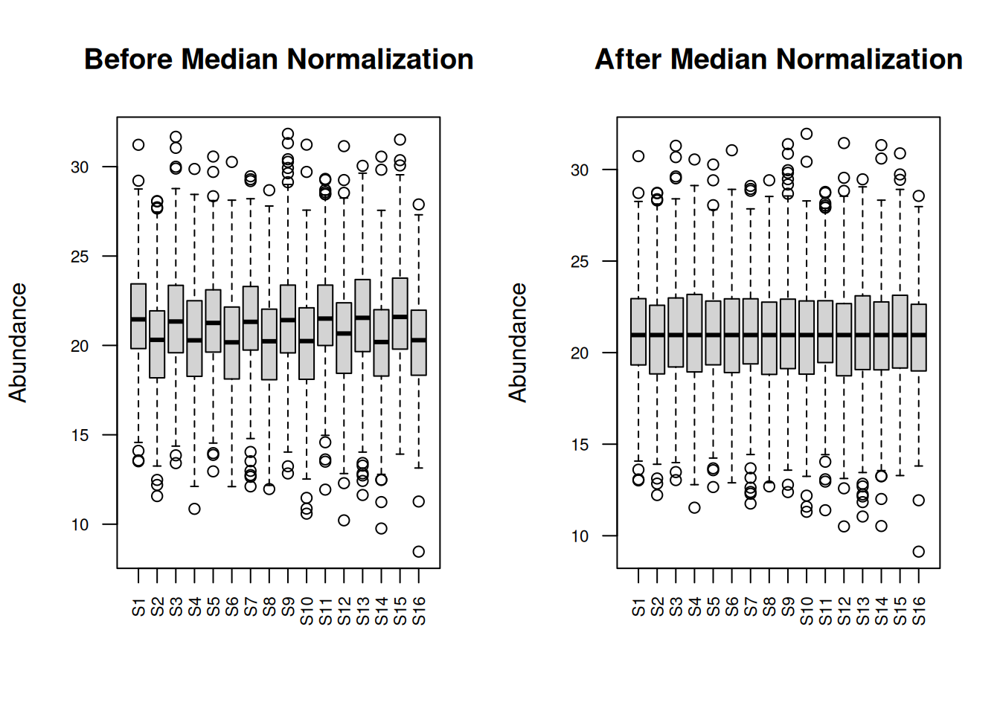
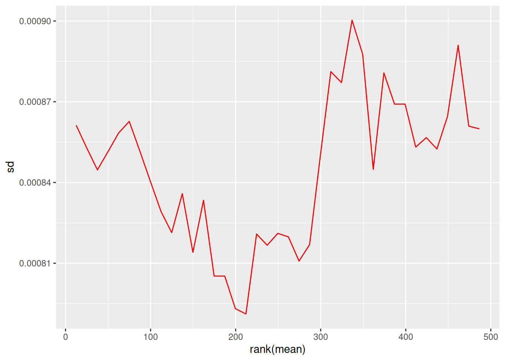

# Preprocessing and Differential Expression {#day3}


## Learning Objectives

By the end of Day 3, you will be able to:

- Apply different normalization methods to proteomic data
- Perform batch effect correction
- Conduct differential expression analysis using limma
- Interpret and visualize differential expression results
- Create volcano plots and MA plots

## Module 1: Data Preprocessing {#day3-mod1}

### Why Normalize?

Normalization removes systematic technical variation to:

- Make samples comparable
- Reduce technical noise
- Preserve biological signal

### Loading Example Data


``` r
# Create example proteomic dataset with technical variation
set.seed(123)

n_proteins <- 500
n_samples <- 16

# Sample metadata
sample_metadata <- data.frame(
  sample_id = paste0("S", 1:n_samples),
  condition = rep(c("Control", "Treatment"), each = 8),
  batch = rep(c("Batch1", "Batch2"), times = 8),
  replicate = rep(1:8, times = 2),
  stringsAsFactors = FALSE
)

# Generate base protein abundances
protein_matrix_raw <- matrix(
  rnorm(n_proteins * n_samples, mean = 20, sd = 3),
  nrow = n_proteins,
  ncol = n_samples
)

rownames(protein_matrix_raw) <- paste0("P", sprintf("%05d", 1:n_proteins))
colnames(protein_matrix_raw) <- sample_metadata$sample_id

# Add biological effect (differential proteins)
de_proteins <- 1:50
protein_matrix_raw[de_proteins, sample_metadata$condition == "Treatment"] <- 
  protein_matrix_raw[de_proteins, sample_metadata$condition == "Treatment"] + 
  rnorm(50 * 8, mean = 2, sd = 0.5)

# Add batch effect
batch1_samples <- sample_metadata$batch == "Batch1"
protein_matrix_raw[, batch1_samples] <- protein_matrix_raw[, batch1_samples] + 1.5

# Add some missing values
missing_idx <- sample(1:length(protein_matrix_raw), size = 500)
protein_matrix_raw[missing_idx] <- NA

cat("Raw data dimensions:", dim(protein_matrix_raw), "\n")
#> Raw data dimensions: 500 16
cat("Missing values:", sum(is.na(protein_matrix_raw)), "\n")
#> Missing values: 500
```

### Handling Missing Values


``` r
# Strategy 1: Remove proteins with too many missing values
threshold <- 0.3  # Remove if >30% missing
missing_per_protein <- rowSums(is.na(protein_matrix_raw)) / ncol(protein_matrix_raw)
filtered_proteins <- missing_per_protein <= threshold

protein_matrix_filtered <- protein_matrix_raw[filtered_proteins, ]

cat("Proteins after filtering:", nrow(protein_matrix_filtered), "\n")
#> Proteins after filtering: 499

# Strategy 2: Imputation (simple mean imputation)
protein_matrix_imputed <- protein_matrix_filtered

for (i in 1:nrow(protein_matrix_imputed)) {
  missing_idx <- is.na(protein_matrix_imputed[i, ])
  if (any(missing_idx)) {
    protein_matrix_imputed[i, missing_idx] <- mean(protein_matrix_imputed[i, ], na.rm = TRUE)
  }
}

cat("Missing values after imputation:", sum(is.na(protein_matrix_imputed)), "\n")
#> Missing values after imputation: 0
```

### Normalization Methods

#### 1. Median Normalization


``` r
# Calculate median for each sample
sample_medians <- apply(protein_matrix_imputed, 2, median, na.rm = TRUE)
global_median <- median(sample_medians)

# Normalize
protein_matrix_median <- protein_matrix_imputed
for (i in 1:ncol(protein_matrix_median)) {
  protein_matrix_median[, i] <- protein_matrix_median[, i] - 
    sample_medians[i] + global_median
}

# Visualize before and after
par(mfrow = c(1, 2))
boxplot(protein_matrix_imputed, main = "Before Median Normalization",
        las = 2, cex.axis = 0.7, ylab = "Abundance")
boxplot(protein_matrix_median, main = "After Median Normalization",
        las = 2, cex.axis = 0.7, ylab = "Abundance")
```



#### 2. Quantile Normalization


``` r
# Quantile normalization
protein_matrix_quantile <- limma::normalizeBetweenArrays(protein_matrix_imputed, 
                                                          method = "quantile")

# Visualize
par(mfrow = c(1, 2))
boxplot(protein_matrix_imputed, main = "Before Quantile Normalization",
        las = 2, cex.axis = 0.7, ylab = "Abundance")
boxplot(protein_matrix_quantile, main = "After Quantile Normalization",
        las = 2, cex.axis = 0.7, ylab = "Abundance")
```


#### 3. VSN (Variance Stabilizing Normalization)


``` r
# VSN normalization
vsn_fit <- vsn::vsn2(protein_matrix_imputed)
protein_matrix_vsn <- vsn::predict(vsn_fit, protein_matrix_imputed)

# Visualize mean-sd relationship
par(mfrow = c(1, 2))
vsn::meanSdPlot(protein_matrix_imputed, main = "Before VSN")
```


``` r
vsn::meanSdPlot(protein_matrix_vsn, main = "After VSN")
```



### Comparing Normalization Methods


``` r
# PCA comparison
plot_pca <- function(data, title, metadata) {
  pca_result <- prcomp(t(data), scale. = FALSE)
  var_exp <- summary(pca_result)$importance[2, 1:2] * 100
  
  pca_df <- data.frame(
    PC1 = pca_result$x[, 1],
    PC2 = pca_result$x[, 2],
    condition = metadata$condition,
    batch = metadata$batch
  )
  
  ggplot(pca_df, aes(x = PC1, y = PC2, color = condition, shape = batch)) +
    geom_point(size = 3) +
    theme_minimal() +
    labs(title = title,
         x = paste0("PC1 (", round(var_exp[1], 1), "%)"),
         y = paste0("PC2 (", round(var_exp[2], 1), "%)")) +
    scale_color_brewer(palette = "Set1")
}

# Compare all methods
p1 <- plot_pca(protein_matrix_imputed, "Raw Data", sample_metadata)
p2 <- plot_pca(protein_matrix_median, "Median Normalized", sample_metadata)
p3 <- plot_pca(protein_matrix_quantile, "Quantile Normalized", sample_metadata)
p4 <- plot_pca(protein_matrix_vsn, "VSN Normalized", sample_metadata)

library(gridExtra)
grid.arrange(p1, p2, p3, p4, ncol = 2)
```


### Exercise 3.1: Apply Normalization

Apply all three normalization methods and:

1. Calculate CV for each method
2. Compare sample correlations
3. Choose the best method for your data


```{.r .fold-hide}
# Solution
calculate_mean_cv <- function(data) {
  cvs <- apply(data, 1, function(x) sd(x, na.rm = TRUE) / mean(x, na.rm = TRUE) * 100)
  mean(cvs, na.rm = TRUE)
}

cat("Mean CV - Raw:", round(calculate_mean_cv(protein_matrix_imputed), 2), "%\n")
#> Mean CV - Raw: 14.1 %
cat("Mean CV - Median:", round(calculate_mean_cv(protein_matrix_median), 2), "%\n")
#> Mean CV - Median: 13.64 %
cat("Mean CV - Quantile:", round(calculate_mean_cv(protein_matrix_quantile), 2), "%\n")
#> Mean CV - Quantile: 13.67 %
cat("Mean CV - VSN:", round(calculate_mean_cv(protein_matrix_vsn), 2), "%\n")
#> Mean CV - VSN: 0.01 %

# Sample correlations
cor_raw <- mean(cor(protein_matrix_imputed)[upper.tri(cor(protein_matrix_imputed))])
cor_median <- mean(cor(protein_matrix_median)[upper.tri(cor(protein_matrix_median))])
cor_quantile <- mean(cor(protein_matrix_quantile)[upper.tri(cor(protein_matrix_quantile))])

cat("\nMean sample correlation - Raw:", round(cor_raw, 3), "\n")
#> 
#> Mean sample correlation - Raw: 0.024
cat("Mean sample correlation - Median:", round(cor_median, 3), "\n")
#> Mean sample correlation - Median: 0.024
cat("Mean sample correlation - Quantile:", round(cor_quantile, 3), "\n")
#> Mean sample correlation - Quantile: 0.024
```

## Module 2: Batch Effect Correction {#day3-mod2}

### Detecting Batch Effects


``` r
# PCA colored by batch
pca_result <- prcomp(t(protein_matrix_quantile), scale. = TRUE)
var_exp <- summary(pca_result)$importance[2, 1:2] * 100

pca_df <- data.frame(
  PC1 = pca_result$x[, 1],
  PC2 = pca_result$x[, 2],
  sample_id = colnames(protein_matrix_quantile)
)
pca_df <- merge(pca_df, sample_metadata, by = "sample_id")

# Plot by batch
p_batch <- ggplot(pca_df, aes(x = PC1, y = PC2, color = batch, shape = condition)) +
  geom_point(size = 4) +
  theme_minimal() +
  labs(title = "PCA - Batch Effect Visible",
       x = paste0("PC1 (", round(var_exp[1], 1), "%)"),
       y = paste0("PC2 (", round(var_exp[2], 1), "%)")) +
  scale_color_manual(values = c("Batch1" = "red", "Batch2" = "blue"))

print(p_batch)
```


### ComBat Batch Correction


``` r
# Prepare for ComBat
batch_vector <- sample_metadata$batch
condition_matrix <- model.matrix(~condition, data = sample_metadata)

# Apply ComBat
protein_matrix_combat <- sva::ComBat(
  dat = protein_matrix_quantile,
  batch = batch_vector,
  mod = condition_matrix,
  par.prior = TRUE,
  prior.plots = FALSE
)

# Compare before and after
pca_combat <- prcomp(t(protein_matrix_combat), scale. = TRUE)
var_exp_combat <- summary(pca_combat)$importance[2, 1:2] * 100

pca_df_combat <- data.frame(
  PC1 = pca_combat$x[, 1],
  PC2 = pca_combat$x[, 2],
  sample_id = colnames(protein_matrix_combat)
)
pca_df_combat <- merge(pca_df_combat, sample_metadata, by = "sample_id")

p_combat <- ggplot(pca_df_combat, aes(x = PC1, y = PC2, color = batch, shape = condition)) +
  geom_point(size = 4) +
  theme_minimal() +
  labs(title = "PCA - After ComBat Correction",
       x = paste0("PC1 (", round(var_exp_combat[1], 1), "%)"),
       y = paste0("PC2 (", round(var_exp_combat[2], 1), "%)")) +
  scale_color_manual(values = c("Batch1" = "red", "Batch2" = "blue"))

library(gridExtra)
grid.arrange(p_batch, p_combat, ncol = 2)
```


### Scaling Methods


``` r
# Z-score scaling (by protein)
protein_matrix_scaled <- t(scale(t(protein_matrix_combat)))

# Pareto scaling
protein_matrix_pareto <- t(scale(t(protein_matrix_combat))) / sqrt(apply(protein_matrix_combat, 1, sd, na.rm = TRUE))

rownames(sample_metadata) <- sample_metadata$sample_id

# Visualize effect of scaling
pheatmap(protein_matrix_combat[1:50, ],
         scale = "row",
         main = "Heatmap with Row Scaling",
         show_rownames = FALSE,
         annotation_col = sample_metadata[, c("condition", "batch"), drop = FALSE])
```


### Exercise 3.2: Complete Preprocessing Pipeline

Create a complete preprocessing function that:

1. Filters proteins with >30% missing
2. Imputes missing values
3. Applies normalization
4. Corrects for batch effects


```{.r .fold-hide}
# Solution
preprocess_proteomics <- function(raw_data, metadata, 
                                   missing_threshold = 0.3,
                                   norm_method = "quantile") {
  # Step 1: Filter
  missing_per_protein <- rowSums(is.na(raw_data)) / ncol(raw_data)
  filtered_data <- raw_data[missing_per_protein <= missing_threshold, ]
  cat("Filtered to", nrow(filtered_data), "proteins\n")
  
  # Step 2: Impute
  imputed_data <- filtered_data
  for (i in 1:nrow(imputed_data)) {
    missing_idx <- is.na(imputed_data[i, ])
    if (any(missing_idx)) {
      imputed_data[i, missing_idx] <- mean(imputed_data[i, ], na.rm = TRUE)
    }
  }
  cat("Imputed", sum(is.na(filtered_data)), "missing values\n")
  
  # Step 3: Normalize
  if (norm_method == "quantile") {
    normalized_data <- limma::normalizeBetweenArrays(imputed_data, method = "quantile")
  } else if (norm_method == "median") {
    sample_medians <- apply(imputed_data, 2, median)
    global_median <- median(sample_medians)
    normalized_data <- sweep(imputed_data, 2, sample_medians - global_median)
  }
  cat("Applied", norm_method, "normalization\n")
  
  # Step 4: Batch correction
  if ("batch" %in% colnames(metadata)) {
    condition_matrix <- model.matrix(~condition, data = metadata)
    corrected_data <- sva::ComBat(
      dat = normalized_data,
      batch = metadata$batch,
      mod = condition_matrix,
      par.prior = TRUE,
      prior.plots = FALSE
    )
    cat("Applied ComBat batch correction\n")
  } else {
    corrected_data <- normalized_data
  }
  
  return(corrected_data)
}

# Apply pipeline
processed_data <- preprocess_proteomics(protein_matrix_raw, sample_metadata)
#> Filtered to 499 proteins
#> Imputed 495 missing values
#> Applied quantile normalization
#> Applied ComBat batch correction
```

## Module 3: Differential Expression Analysis {#day3-mod3}

### Introduction to limma

limma (Linear Models for Microarray Data) is widely used for differential expression.

Key advantages:
- Empirical Bayes moderation
- Handles complex designs
- Works well with small sample sizes

### Basic Differential Expression


``` r
# Design matrix
design <- model.matrix(~0 + condition, data = sample_metadata)
colnames(design) <- c("Control", "Treatment")

# Fit linear model
fit <- lmFit(processed_data, design)

# Define contrast
contrast_matrix <- makeContrasts(
  TreatmentVsControl = Treatment - Control,
  levels = design
)

# Fit contrasts
fit2 <- contrasts.fit(fit, contrast_matrix)

# Empirical Bayes moderation
fit2 <- eBayes(fit2)

# Extract results
results <- topTable(fit2, coef = "TreatmentVsControl", number = Inf)

# Add protein IDs
results$protein_id <- rownames(results)

# View top results
head(results, 10)
#>            logFC  AveExpr         t      P.Value  adj.P.Val
#> P00043  5.029106 21.80541  3.895339 0.0001918769 0.06177827
#> P00026  5.054234 21.53741  3.730775 0.0003393640 0.06177827
#> P00439  5.116733 19.94913  3.704324 0.0003714124 0.06177827
#> P00041  4.754682 21.88690  3.521085 0.0006863510 0.07551792
#> P00050  4.458502 20.12443  3.472990 0.0008037582 0.07551792
#> P00448 -4.602952 20.09167 -3.435547 0.0009080311 0.07551792
#> P00204 -4.367604 20.06731 -3.373940 0.0011077982 0.07897018
#> P00037  4.021590 22.72349  3.151759 0.0022255595 0.13881927
#> P00326 -4.055987 20.17611 -3.083566 0.0027397386 0.15190329
#> P00025  3.882010 20.47140  2.992742 0.0035966903 0.17947484
#>                  B protein_id
#> P00043  0.51632573     P00043
#> P00026  0.04550759     P00026
#> P00439 -0.02887366     P00439
#> P00041 -0.53393668     P00041
#> P00050 -0.66346841     P00050
#> P00448 -0.76341971     P00448
#> P00204 -0.92614479     P00204
#> P00037 -1.49463286     P00037
#> P00326 -1.66317428     P00326
#> P00025 -1.88317691     P00025

# Summary
cat("\nDifferential Expression Summary:\n")
#> 
#> Differential Expression Summary:
cat("Significant proteins (FDR < 0.05):", sum(results$adj.P.Val < 0.05), "\n")
#> Significant proteins (FDR < 0.05): 0
cat("Upregulated (FC > 1.5, FDR < 0.05):", 
    sum(results$adj.P.Val < 0.05 & results$logFC > log2(1.5)), "\n")
#> Upregulated (FC > 1.5, FDR < 0.05): 0
cat("Downregulated (FC < -1.5, FDR < 0.05):", 
    sum(results$adj.P.Val < 0.05 & results$logFC < -log2(1.5)), "\n")
#> Downregulated (FC < -1.5, FDR < 0.05): 0
```

### Volcano Plot


``` r
# Prepare data for volcano plot
volcano_data <- results
volcano_data$significance <- "NS"
volcano_data$significance[volcano_data$adj.P.Val < 0.05 & volcano_data$logFC > log2(1.5)] <- "Up"
volcano_data$significance[volcano_data$adj.P.Val < 0.05 & volcano_data$logFC < -log2(1.5)] <- "Down"

# Volcano plot
ggplot(volcano_data, aes(x = logFC, y = -log10(adj.P.Val), color = significance)) +
  geom_point(alpha = 0.6, size = 2) +
  scale_color_manual(values = c("Up" = "red", "Down" = "blue", "NS" = "grey")) +
  geom_hline(yintercept = -log10(0.05), linetype = "dashed") +
  geom_vline(xintercept = c(-log2(1.5), log2(1.5)), linetype = "dashed") +
  theme_minimal() +
  labs(title = "Volcano Plot: Treatment vs Control",
       x = "log2 Fold Change",
       y = "-log10 Adjusted P-value") +
  theme(legend.title = element_blank())
```


### MA Plot


``` r
# MA plot
volcano_data$AveExpr <- results$AveExpr

ggplot(volcano_data, aes(x = AveExpr, y = logFC, color = significance)) +
  geom_point(alpha = 0.6, size = 2) +
  scale_color_manual(values = c("Up" = "red", "Down" = "blue", "NS" = "grey")) +
  geom_hline(yintercept = 0, linetype = "solid") +
  geom_hline(yintercept = c(-log2(1.5), log2(1.5)), linetype = "dashed") +
  theme_minimal() +
  labs(title = "MA Plot: Treatment vs Control",
       x = "Average Expression",
       y = "log2 Fold Change") +
  theme(legend.title = element_blank())
```


### Heatmap of DE Proteins


``` r
# Select significant proteins
sig_proteins <- rownames(results[results$adj.P.Val < 0.05, ])

# Plot heatmap if there are significant proteins
if (length(sig_proteins) > 1) {
  pheatmap(processed_data[sig_proteins, ],
           scale = "row",
           clustering_distance_rows = "correlation",
           clustering_distance_cols = "euclidean",
           annotation_col = sample_metadata[, c("condition")],
           show_rownames = FALSE,
           show_colnames = TRUE,
           fontsize_col = 10,
           main = "Heatmap of Significantly Differentially Expressed Proteins")
} else {
  cat("Not enough significant proteins to generate a heatmap.\n")
}
#> Not enough significant proteins to generate a heatmap.
```
