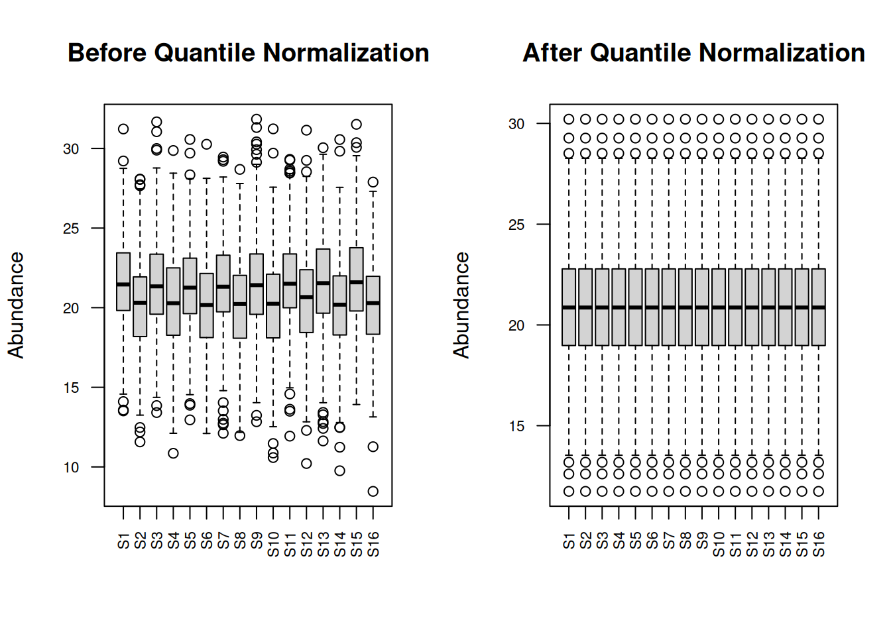
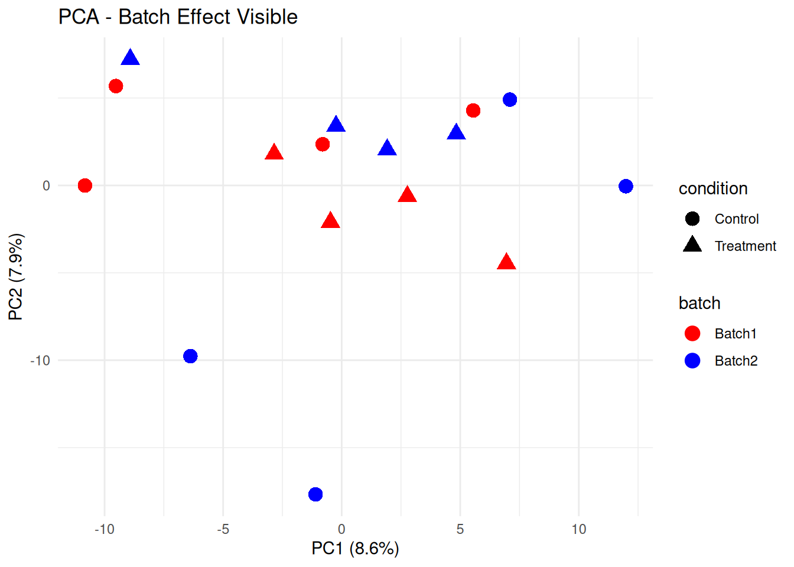
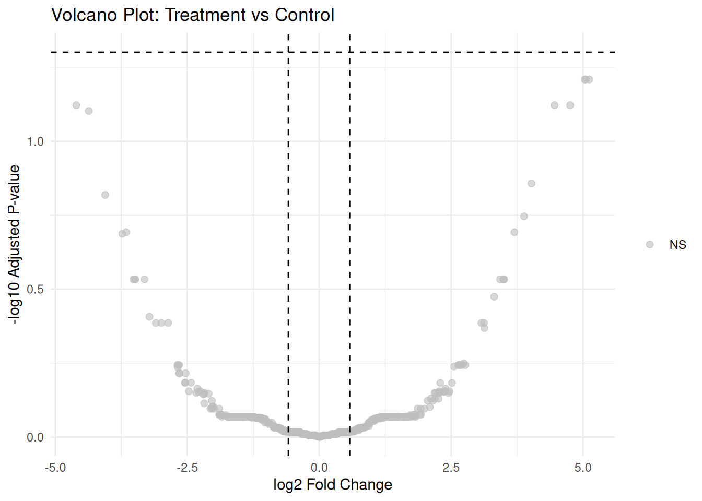

# Preprocessing and Differential Expression {#day3}


## Learning Objectives

By the end of Day 3, you will be able to:

- Apply different normalization methods to proteomic data
- Perform batch effect correction
- Conduct differential expression analysis using limma
- Interpret and visualize differential expression results
- Create volcano plots and MA plots

## Module 1: Data Preprocessing {#day3-mod1}

### Why Normalize?

Normalization removes systematic technical variation to:

- Make samples comparable
- Reduce technical noise
- Preserve biological signal

### Loading Example Data


``` r
# Load the data components
protein_matrix <- read.csv("data/protein_matrix.csv", row.names = 1, 
                           check.names = FALSE) # Proteins × Samples
sample_metadata <- read.csv("data/sample_metadata.csv")
protein_annotations <- read.csv("data/protein_annotations.csv")
```

### Initial Data Exploration


``` r
cat("=== DATASET STRUCTURE ===\n")
#> === DATASET STRUCTURE ===
cat("Protein matrix dimensions:", dim(protein_matrix), "\n")
#> Protein matrix dimensions: 1500 24
cat("Sample metadata:\n")
#> Sample metadata:
print(sample_metadata)
#>    sample_id condition  batch timepoint patient_id sex age
#> 1        S01   Control Batch1     Week0          1   M  46
#> 2        S02   Control Batch1     Week0          2   M  43
#> 3        S03   Control Batch1     Week0          3   M  64
#> 4        S04   Control Batch1     Week0          4   M  44
#> 5        S05   Control Batch1     Week4          5   F  53
#> 6        S06   Control Batch1     Week4          6   F  59
#> 7        S07   Control Batch1     Week4          7   F  65
#> 8        S08   Control Batch1     Week4          8   F  57
#> 9        S09   Control Batch2     Week8          9   M  54
#> 10       S10   Control Batch2     Week8         10   F  42
#> 11       S11   Control Batch2     Week8         11   M  48
#> 12       S12   Control Batch2     Week8         12   F  64
#> 13       S13 Treatment Batch2     Week0          1   M  46
#> 14       S14 Treatment Batch2     Week0          2   M  43
#> 15       S15 Treatment Batch2     Week0          3   M  64
#> 16       S16 Treatment Batch2     Week0          4   M  44
#> 17       S17 Treatment Batch3     Week4          5   F  53
#> 18       S18 Treatment Batch3     Week4          6   F  59
#> 19       S19 Treatment Batch3     Week4          7   F  65
#> 20       S20 Treatment Batch3     Week4          8   F  57
#> 21       S21 Treatment Batch3     Week8          9   M  54
#> 22       S22 Treatment Batch3     Week8         10   F  42
#> 23       S23 Treatment Batch3     Week8         11   M  48
#> 24       S24 Treatment Batch3     Week8         12   F  64

cat("\nProtein annotations (first 5):\n")
#> 
#> Protein annotations (first 5):
print(head(protein_annotations, 5))
#>   protein_id gene_symbol protein_name molecular_weight
#> 1     P00001      CTNNB1 Protein_1953           120953
#> 2     P00002        AKT1 Protein_1945           205283
#> 3     P00003      PIK3CA Protein_2735            18375
#> 4     P00004         RET Protein_4380            65719
#> 5     P00005      PIK3CA Protein_4658           222652
#>   peptide_count confidence_score
#> 1            22             50.3
#> 2            11             77.6
#> 3             3             66.8
#> 4            12             59.7
#> 5             2             93.1

cat("\nExperimental design:\n")
#> 
#> Experimental design:
design_table <- table(sample_metadata$condition, sample_metadata$batch)
print(design_table)
#>            
#>             Batch1 Batch2 Batch3
#>   Control        8      4      0
#>   Treatment      0      4      8

cat("\nData summary:\n")
#> 
#> Data summary:
summary_stats <- data.frame(
  Statistic = c("Total proteins", "Total samples", "Missing values", "Missing percentage"),
  Value = c(
    nrow(protein_matrix),
    ncol(protein_matrix),
    sum(is.na(protein_matrix)),
    paste0(round(mean(is.na(protein_matrix)) * 100, 1), "%")
  )
)
print(summary_stats)
#>            Statistic Value
#> 1     Total proteins  1500
#> 2      Total samples    24
#> 3     Missing values  6172
#> 4 Missing percentage 17.1%

par(mfrow = c(1, 2))
boxplot(protein_matrix, main = "Raw Data - Before Preprocessing", 
        las = 2, cex.axis = 0.7, ylab = "Log2 Abundance")
plot(density(protein_matrix[!is.na(protein_matrix)], na.rm = TRUE), 
     main = "Distribution of Raw Values")
```


### Handling Missing Values


``` r
# Strategy 1: Remove proteins with too many missing values
threshold <- 0.3  # Remove if >30% missing
missing_per_protein <- rowSums(is.na(protein_matrix)) / ncol(protein_matrix)
filtered_proteins <- missing_per_protein <= threshold

protein_matrix_filtered <- protein_matrix[filtered_proteins, ]

cat("Proteins after filtering:", nrow(protein_matrix_filtered), "\n")
#> Proteins after filtering: 1383

# Strategy 2: Imputation (simple mean imputation) with a function
handle_missing_values <- function(data_matrix, missing_threshold = 0.2, 
                                  impute_method = "min") {
  
  cat("Initial proteins:", nrow(data_matrix), "\n")
  cat("Initial missing values:", sum(is.na(data_matrix)), "\n")
  
  # Strategy 1: Remove proteins with too many missing values
  missing_per_protein <- rowSums(is.na(data_matrix)) / ncol(data_matrix)
  filtered_proteins <- missing_per_protein <= missing_threshold
  
  data_filtered <- data_matrix[filtered_proteins, ]
  cat("Proteins after filtering (missing <=", 
      missing_threshold*100, "%):", nrow(data_filtered), "\n")
  
  # Strategy 2: Improved imputation
  data_imputed <- data_filtered
  
  for (i in 1:nrow(data_imputed)) {
    row_vals <- data_imputed[i, ]
    
    if (any(is.na(row_vals))) {
      if (impute_method == "min") {
        # Impute with minimum value per protein (common in proteomics)
        impute_val <- min(row_vals, na.rm = TRUE) - 0.5  # Slightly below minimum
      } else if (impute_method == "mean") {
        # Mean imputation
        impute_val <- mean(row_vals, na.rm = TRUE)
      } else if (impute_method == "knn") {
        # Simple k-NN approximation (using row mean as proxy)
        impute_val <- mean(row_vals, na.rm = TRUE)
      }
      
      data_imputed[i, is.na(row_vals)] <- impute_val
    }
  }
  
  cat("Missing values after imputation:", sum(is.na(data_imputed)), "\n")
  
  return(data_imputed)
}

# Apply missing value handling
protein_matrix_imputed <- handle_missing_values(protein_matrix, 
                                                missing_threshold = 0.3, 
                                                impute_method = "min")
#> Initial proteins: 1500 
#> Initial missing values: 6172 
#> Proteins after filtering (missing <= 30 %): 1383 
#> Missing values after imputation: 0

# Verify imputation worked
cat("\nAfter imputation:\n")
#> 
#> After imputation:
cat("Dimensions:", dim(protein_matrix_imputed), "\n")
#> Dimensions: 1383 24
cat("Missing values:", sum(is.na(protein_matrix_imputed)), "\n")
#> Missing values: 0
```

### Normalization Methods

#### 1. Median Normalization


``` r
# Calculate median for each sample
sample_medians <- apply(protein_matrix_imputed, 2, median, na.rm = TRUE)
global_median <- median(sample_medians)

# Normalize
protein_matrix_median <- protein_matrix_imputed
for (i in 1:ncol(protein_matrix_median)) {
  protein_matrix_median[, i] <- protein_matrix_median[, i] - 
    sample_medians[i] + global_median
}

# Visualize before and after
par(mfrow = c(1, 2))
boxplot(protein_matrix_imputed, main = "Before Median Normalization",
        las = 2, cex.axis = 0.7, ylab = "Abundance")
boxplot(protein_matrix_median, main = "After Median Normalization",
        las = 2, cex.axis = 0.7, ylab = "Abundance")
```


#### 2. Quantile Normalization


``` r
# Quantile normalization
protein_matrix_quantile <- limma::normalizeBetweenArrays(protein_matrix_imputed, 
                                                          method = "quantile")

# Visualize
par(mfrow = c(1, 2))
boxplot(protein_matrix_imputed, main = "Before Quantile Normalization",
        las = 2, cex.axis = 0.7, ylab = "Abundance")
boxplot(protein_matrix_quantile, main = "After Quantile Normalization",
        las = 2, cex.axis = 0.7, ylab = "Abundance")
```



#### 3. VSN (Variance Stabilizing Normalization)


``` r
protein_matrix_imputed <- as.matrix(protein_matrix_imputed)
# VSN normalization
vsn_fit <- vsn::vsn2(protein_matrix_imputed)
protein_matrix_vsn <- vsn::predict(vsn_fit, protein_matrix_imputed)

# Visualize mean-sd relationship
par(mfrow = c(1, 2))
vsn::meanSdPlot(protein_matrix_imputed, main = "Before VSN")
```


``` r
vsn::meanSdPlot(protein_matrix_vsn, main = "After VSN")
```


### Comparing Normalization Methods


``` r
# PCA comparison
plot_pca <- function(data, title, metadata) {
  pca_result <- prcomp(t(data), scale. = FALSE)
  var_exp <- summary(pca_result)$importance[2, 1:2] * 100
  
  pca_df <- data.frame(
    PC1 = pca_result$x[, 1],
    PC2 = pca_result$x[, 2],
    condition = metadata$condition,
    batch = metadata$batch
  )
  
  ggplot(pca_df, aes(x = PC1, y = PC2, color = condition, shape = batch)) +
    geom_point(size = 3) +
    theme_minimal() +
    labs(title = title,
         x = paste0("PC1 (", round(var_exp[1], 1), "%)"),
         y = paste0("PC2 (", round(var_exp[2], 1), "%)")) +
    scale_color_brewer(palette = "Set1")
}

# Compare all methods
p1 <- plot_pca(protein_matrix_imputed, "Raw Data", sample_metadata)
p2 <- plot_pca(protein_matrix_median, "Median Normalized", sample_metadata)
p3 <- plot_pca(protein_matrix_quantile, "Quantile Normalized", sample_metadata)
p4 <- plot_pca(protein_matrix_vsn, "VSN Normalized", sample_metadata)

library(gridExtra)
grid.arrange(p1, p2, p3, p4, ncol = 2)
```


### Exercise 3.1: Apply Normalization

Apply all three normalization methods and:

1. Calculate CV for each method
2. Compare sample correlations
3. Choose the best method for your data


```{.r .fold-hide}
# Solution
calculate_mean_cv <- function(data) {
  cvs <- apply(data, 1, function(x) sd(x, na.rm = TRUE) / mean(x, na.rm = TRUE) * 100)
  mean(cvs, na.rm = TRUE)
}

cat("Mean CV - Raw:", round(calculate_mean_cv(protein_matrix_imputed), 2), "%\n")
#> Mean CV - Raw: 3.93 %
cat("Mean CV - Median:", round(calculate_mean_cv(protein_matrix_median), 2), "%\n")
#> Mean CV - Median: 3.5 %
cat("Mean CV - Quantile:", round(calculate_mean_cv(protein_matrix_quantile), 2), "%\n")
#> Mean CV - Quantile: 3.45 %
cat("Mean CV - VSN:", round(calculate_mean_cv(protein_matrix_vsn), 2), "%\n")
#> Mean CV - VSN: 1.14 %

# Sample correlations
cor_raw <- mean(cor(protein_matrix_imputed)[upper.tri(cor(protein_matrix_imputed))])
cor_median <- mean(cor(protein_matrix_median)[upper.tri(cor(protein_matrix_median))])
cor_quantile <- mean(cor(protein_matrix_quantile)[upper.tri(cor(protein_matrix_quantile))])

cat("\nMean sample correlation - Raw:", round(cor_raw, 3), "\n")
#> 
#> Mean sample correlation - Raw: 0.36
cat("Mean sample correlation - Median:", round(cor_median, 3), "\n")
#> Mean sample correlation - Median: 0.36
cat("Mean sample correlation - Quantile:", round(cor_quantile, 3), "\n")
#> Mean sample correlation - Quantile: 0.359
```

## Module 2: Batch Effect Correction {#day3-mod2}

### Detecting Batch Effects


``` r
# PCA colored by batch
pca_result <- prcomp(t(protein_matrix_quantile), scale. = TRUE)
var_exp <- summary(pca_result)$importance[2, 1:2] * 100

pca_df <- data.frame(
  PC1 = pca_result$x[, 1],
  PC2 = pca_result$x[, 2],
  sample_id = colnames(protein_matrix_quantile)
)
pca_df <- merge(pca_df, sample_metadata, by = "sample_id")

# Plot by batch
p_batch <- ggplot(pca_df, aes(x = PC1, y = PC2, color = batch, shape = condition)) +
  geom_point(size = 4) +
  theme_minimal() +
  labs(title = "PCA - Batch Effect Visible",
       x = paste0("PC1 (", round(var_exp[1], 1), "%)"),
       y = paste0("PC2 (", round(var_exp[2], 1), "%)")) +
  scale_color_manual(values = c("Batch1" = "red", "Batch2" = "blue"))

print(p_batch)
```



### ComBat Batch Correction


``` r
# Prepare for ComBat
batch_vector <- sample_metadata$batch
condition_matrix <- model.matrix(~condition, data = sample_metadata)

# Apply ComBat
protein_matrix_combat <- sva::ComBat(
  dat = protein_matrix_quantile,
  batch = batch_vector,
  mod = condition_matrix,
  par.prior = TRUE,
  prior.plots = FALSE
)
#> Found 1 genes with uniform expression within a single batch (all zeros); these will not be adjusted for batch.

# Compare before and after
pca_combat <- prcomp(t(protein_matrix_combat), scale. = TRUE)
var_exp_combat <- summary(pca_combat)$importance[2, 1:2] * 100

pca_df_combat <- data.frame(
  PC1 = pca_combat$x[, 1],
  PC2 = pca_combat$x[, 2],
  sample_id = colnames(protein_matrix_combat)
)
pca_df_combat <- merge(pca_df_combat, sample_metadata, by = "sample_id")

p_combat <- ggplot(pca_df_combat, aes(x = PC1, y = PC2, color = batch, shape = condition)) +
  geom_point(size = 4) +
  theme_minimal() +
  labs(title = "PCA - After ComBat Correction",
       x = paste0("PC1 (", round(var_exp_combat[1], 1), "%)"),
       y = paste0("PC2 (", round(var_exp_combat[2], 1), "%)")) +
  scale_color_manual(values = c("Batch1" = "red", "Batch2" = "blue"))

library(gridExtra)
grid.arrange(p_batch, p_combat, ncol = 2)
```


### Scaling Methods


``` r
# Z-score scaling (by protein)
protein_matrix_scaled <- t(scale(t(protein_matrix_combat)))

# Pareto scaling
protein_matrix_pareto <- t(scale(t(protein_matrix_combat))) / sqrt(apply(protein_matrix_combat, 1, sd, na.rm = TRUE))

rownames(sample_metadata) <- sample_metadata$sample_id

# Visualize effect of scaling
pheatmap(protein_matrix_combat[1:1000, ],
         scale = "row",
         main = "Heatmap with Row Scaling",
         show_rownames = FALSE,
         annotation_col = sample_metadata[, c("condition", "batch"), drop = FALSE])
```


### Exercise 3.2: Complete Preprocessing Pipeline

Create a complete preprocessing function that:

1. Filters proteins with >30% missing
2. Imputes missing values
3. Applies normalization
4. Corrects for batch effects


```{.r .fold-hide}
# Solution
preprocess_proteomics <- function(raw_data, metadata, 
                                   missing_threshold = 0.3,
                                   norm_method = "quantile",
                                  batch_correction = TRUE) {
  # Step 1: Filter
  missing_per_protein <- rowSums(is.na(raw_data)) / ncol(raw_data)
  filtered_data <- raw_data[missing_per_protein <= missing_threshold, ]
  cat("Filtered to", nrow(filtered_data), "proteins\n")
  
  # Step 2: Impute
  impute_method = "min"
  data_imputed <- filtered_data
  for (i in 1:nrow(data_imputed)) {
    row_vals <- data_imputed[i, ]
    
    if (any(is.na(row_vals))) {
      if (impute_method == "min") {
        # Impute with minimum value per protein (common in proteomics)
        impute_val <- min(row_vals, na.rm = TRUE) - 0.5  # Slightly below minimum
      } else if (impute_method == "mean") {
        # Mean imputation
        impute_val <- mean(row_vals, na.rm = TRUE)
      } else if (impute_method == "knn") {
        # Simple k-NN approximation (using row mean as proxy)
        impute_val <- mean(row_vals, na.rm = TRUE)
      }
      
      data_imputed[i, is.na(row_vals)] <- impute_val
    }
  }
  cat("Imputed", sum(is.na(filtered_data)), "missing values\n")
  
  # Step 3: Normalize
  if (norm_method == "quantile") {
    normalized_data <- limma::normalizeBetweenArrays(data_imputed, method = "quantile")
  } else if (norm_method == "median") {
    sample_medians <- apply(data_imputed, 2, median)
    global_median <- median(sample_medians)
    normalized_data <- sweep(imputed_data, 2, sample_medians - global_median)
  }
  cat("Applied", norm_method, "normalization\n")
  
  # Step 4: Batch correction
  if (batch_correction && "batch" %in% colnames(metadata)) {
    condition_matrix <- model.matrix(~condition, data = metadata)
    corrected_data <- sva::ComBat(
      dat = normalized_data,
      batch = metadata$batch,
      mod = condition_matrix,
      par.prior = TRUE,
      prior.plots = FALSE
    )
    cat("Applied ComBat batch correction\n")
  } else {
    corrected_data <- normalized_data
  }
  
  return(corrected_data)
}

# Apply pipeline
processed_data <- preprocess_proteomics(protein_matrix, sample_metadata)
#> Filtered to 1383 proteins
#> Imputed 4014 missing values
#> Applied quantile normalization
#> Found 1 genes with uniform expression within a single batch (all zeros); these will not be adjusted for batch.
#> Applied ComBat batch correction
```

## Module 3: Differential Expression Analysis {#day3-mod3}

### Introduction to limma

limma (Linear Models for Microarray Data) is widely used for differential expression.

Key advantages:
- Empirical Bayes moderation
- Handles complex designs
- Works well with small sample sizes

### Basic Differential Expression


``` r
# Design matrix
design <- model.matrix(~0 + condition, data = sample_metadata)
colnames(design) <- c("Control", "Treatment")

# Fit linear model
fit <- lmFit(processed_data, design)

# Define contrast
contrast_matrix <- makeContrasts(
  TreatmentVsControl = Treatment - Control,
  levels = design
)

# Fit contrasts
fit2 <- contrasts.fit(fit, contrast_matrix)

# Empirical Bayes moderation
fit2 <- eBayes(fit2)

# Extract results
de_results <- topTable(fit2, coef = "TreatmentVsControl", number = Inf)

# Add protein IDs and annotations
de_results$protein_id <- rownames(de_results)
de_results_annotated <- de_results %>%
  left_join(protein_annotations, by = "protein_id")

# View top results
cat("\nTop 10 differentially expressed proteins:\n")
#> 
#> Top 10 differentially expressed proteins:
print(de_results_annotated[1:10, c("protein_id", "gene_symbol", "logFC", "P.Value", "adj.P.Val")])
#>    protein_id gene_symbol     logFC      P.Value
#> 1      P01172         MYC -3.259075 3.102431e-18
#> 2      P00804       MAPK1 -2.617582 8.924126e-17
#> 3      P00857        AKT1 -3.173146 7.084863e-15
#> 4      P00825         APC -1.749628 1.493181e-12
#> 5      P00438         KIT  2.229704 3.682046e-12
#> 6      P01138         FAS -1.700512 5.270544e-12
#> 7      P00043        EGFR -2.335420 3.513380e-11
#> 8      P01176        MTOR -2.235232 3.607181e-11
#> 9      P00421       CCND1  2.496499 1.739572e-10
#> 10     P01322        KRAS  1.387225 2.164925e-10
#>       adj.P.Val
#> 1  4.290661e-15
#> 2  6.171033e-14
#> 3  3.266122e-12
#> 4  5.162673e-10
#> 5  1.018454e-09
#> 6  1.214860e-09
#> 7  6.235913e-09
#> 8  6.235913e-09
#> 9  2.673143e-08
#> 10 2.994091e-08

# Summary
cat("\nDifferential Expression Summary:\n")
#> 
#> Differential Expression Summary:
cat("Significant proteins (FDR < 0.05):", sum(de_results$adj.P.Val < 0.05), "\n")
#> Significant proteins (FDR < 0.05): 227
cat("Upregulated (FC > 1.5, FDR < 0.05):", 
    sum(de_results$adj.P.Val < 0.05 & de_results$logFC > log2(1.5)), "\n")
#> Upregulated (FC > 1.5, FDR < 0.05): 107
cat("Downregulated (FC < -1.5, FDR < 0.05):", 
    sum(de_results$adj.P.Val < 0.05 & de_results$logFC < -log2(1.5)), "\n")
#> Downregulated (FC < -1.5, FDR < 0.05): 109
```

### Volcano Plot


``` r
# Prepare data for volcano plot
volcano_data <- de_results
volcano_data$significance <- "NS"
volcano_data$significance[volcano_data$adj.P.Val < 0.05 & volcano_data$logFC > log2(1.5)] <- "Up"
volcano_data$significance[volcano_data$adj.P.Val < 0.05 & volcano_data$logFC < -log2(1.5)] <- "Down"

# Volcano plot
ggplot(volcano_data, aes(x = logFC, y = -log10(adj.P.Val), color = significance)) +
  geom_point(alpha = 0.6, size = 2) +
  scale_color_manual(values = c("Up" = "red", "Down" = "blue", "NS" = "grey")) +
  geom_hline(yintercept = -log10(0.05), linetype = "dashed") +
  geom_vline(xintercept = c(-log2(1.5), log2(1.5)), linetype = "dashed") +
  theme_minimal() +
  labs(title = "Volcano Plot: Treatment vs Control",
       x = "log2 Fold Change",
       y = "-log10 Adjusted P-value") +
  theme(legend.title = element_blank())
```



### MA Plot


``` r
# MA plot
volcano_data$AveExpr <- de_results$AveExpr

ggplot(volcano_data, aes(x = AveExpr, y = logFC, color = significance)) +
  geom_point(alpha = 0.6, size = 2) +
  scale_color_manual(values = c("Up" = "red", "Down" = "blue", "NS" = "grey")) +
  geom_hline(yintercept = 0, linetype = "solid") +
  geom_hline(yintercept = c(-log2(1.5), log2(1.5)), linetype = "dashed") +
  theme_minimal() +
  labs(title = "MA Plot: Treatment vs Control",
       x = "Average Expression",
       y = "log2 Fold Change") +
  theme(legend.title = element_blank())
```


### Heatmap of DE Proteins


``` r
# Select significant proteins
sig_proteins <- rownames(de_results[de_results$adj.P.Val < 0.05, ])

annotation_col <- as.data.frame(sample_metadata[, c("condition")])
colnames(annotation_col) <- "Condition"
rownames(annotation_col) <- sample_metadata$sample_id

# Plot heatmap if there are significant proteins
if (length(sig_proteins) > 1) {
  pheatmap(processed_data[sig_proteins, ],
           scale = "row",
           clustering_distance_rows = "correlation",
           clustering_distance_cols = "euclidean",
           annotation_col = annotation_col, 
           show_rownames = FALSE,
           show_colnames = TRUE,
           fontsize_col = 10, 
           main = "Heatmap of Significantly Differentially Expressed Proteins")
} else {
  cat("Not enough significant proteins to generate a heatmap.\n")
}
```


### Save Results for Day 4


``` r
# Create results directory
if (!dir.exists("results")) {
    dir.create("results")
}

# Save processed data and results
saveRDS(processed_data, "results/day3_processed_data.rds")
saveRDS(de_results_annotated, "results/day3_de_results.rds")

# Also save a summary table
de_summary <- de_results_annotated %>%
    filter(adj.P.Val < 0.05) %>%
    dplyr::select(protein_id, gene_symbol, logFC, P.Value, adj.P.Val, protein_name)

write.csv(de_summary, "results/day3_significant_proteins.csv", row.names = FALSE)

cat("\nResults saved for Day 4:\n")
#> 
#> Results saved for Day 4:
cat("- Processed data: results/day3_processed_data.rds\n")
#> - Processed data: results/day3_processed_data.rds
cat("- DE results: results/day3_de_results.rds\n")
#> - DE results: results/day3_de_results.rds
cat("- Significant proteins: results/day3_significant_proteins.csv\n")
#> - Significant proteins: results/day3_significant_proteins.csv
```

## Day 3 Summary

Today you learned:

- ✓ How to handle missing values in proteomic data
- ✓ Different normalization methods and their effects
- ✓ Batch effect detection and correction using ComBat
- ✓ Differential expression analysis with limma
- ✓ Visualization of DE results (volcano plots, MA plots, heatmaps)

### Key Takeaways

1. **Normalization** is crucial for making samples comparable
2. **Batch correction** can remove technical artifacts
3. **limma** provides robust differential expression analysis
4. **Visualization** helps interpret complex DE results

### Homework

1. Try different normalization methods and compare results
2. Experiment with different FDR and fold change thresholds
3. Create custom visualizations for your specific research questions


``` r
# Prepare for Day 4
install.packages(c("clusterProfiler", "enrichplot", "org.Hs.eg.db"))

if (!requireNamespace("BiocManager", quietly = TRUE))
    install.packages("BiocManager")

BiocManager::install(c("clusterProfiler", "enrichplot", "org.Hs.eg.db"))
```

## Additional Resources

- [limma User's Guide](https://www.bioconductor.org/packages/release/bioc/vignettes/limma/inst/doc/usersguide.pdf)
- [ComBat paper](https://academic.oup.com/biostatistics/article/8/1/118/252073)
- [Proteomics normalization review](https://www.ncbi.nlm.nih.gov/pmc/articles/PMC4930168/)


