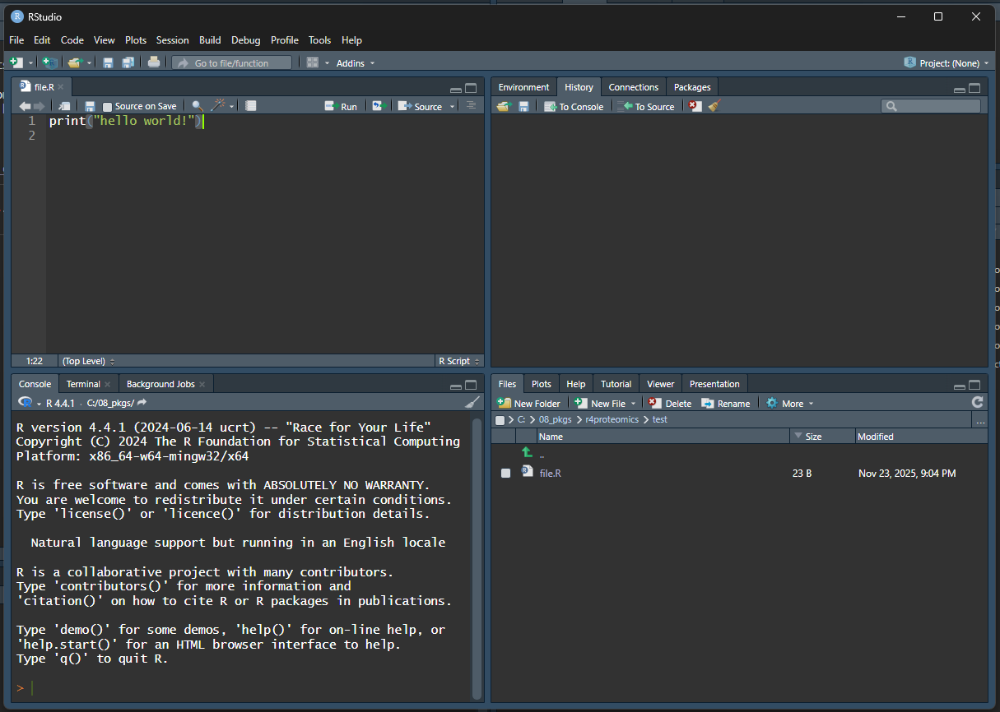

class: inverse, center, middle

# Introduction to R and RStudio

---

## Learning Objectives

By the end of Day 1, you will be able to:

- Install and navigate RStudio effectively
- Understand basic R data structures (vectors, data frames, lists)
- Import and explore simple datasets
- Write basic control flow structures and functions

---

## Module 1: Setting Up and Getting Started

### Introduction

R is a powerful programming language and environment specifically designed for statistical computing and graphics.

RStudio is an integrated development environment (IDE) that makes working with R much easier.

---

## Installing R and RStudio

.pull-left[
**Install R** (version 4.3.0 or higher)
- Visit https://cran.r-project.org/
- Download for your OS
- Run installer
]

.pull-right[
**Install RStudio Desktop**
- Visit https://posit.co/download/rstudio-desktop/
- Download free version
- Run installer
]

---

## RStudio Interface Tour

.pull-left[
**Four Main Panes:**
1. **Source Editor** (top-left): Write and edit scripts
2. **Console** (bottom-left): Execute code
3. **Environment/History** (top-right): Objects and command history
4. **Files/Plots/Packages/Help** (bottom-right): File browser, plots, packages, help
]

.pull-right[

]

---

## Scripts vs Console

.pull-left[
**Console** is for:
- Quick calculations 
- Testing commands 
- Interactive exploration
]

.pull-right[
**Scripts** (.R or .Rmd files) are for:
- Saving your work 
- Creating reproducible analyses 
- Organizing complex workflows
]

---

## Install Required Packages

```r
# Install CRAN packages
install.packages(c(
  "bookdown", "rmarkdown", "knitr", "pheatmap", "ggplot2", 
  "downlit", "xml2", "reshape2", "gridExtra", "tidyverse", "lme4"
))

# Install Bioconductor packages
if (!requireNamespace("BiocManager", quietly = TRUE))
  install.packages("BiocManager")

BiocManager::install(c(
  "limma", "vsn", "sva", "clusterProfiler", "org.Hs.eg.db",
  "KEGGREST", "AnnotationDbi", "annotate", "GO.db"
))
```

---

## Basic Operators

**Important notes:**
- R is case sensitive (`b` ≠ `B`)
- Lines starting with `#` are comments (not evaluated)

```r
# Arithmetic operators
5 + 3        # Addition
10 - 4       # Subtraction
6 * 7        # Multiplication
20 / 4       # Division
2 ^ 3        # Exponentiation

# Comparison operators
5 == 5       # Equal to
5 != 3       # Not equal to
7 > 3        # Greater than
# Logical operators
TRUE & FALSE  # AND
TRUE | FALSE  # OR
!TRUE         # NOT
```

---

## Variables & Assignment

**Naming conventions:**
- Use dots or underscores: `my.variable_name`
- Spaces in operators don't matter: `3+2` = `3 + 2`

```r
# Assignment operator (preferred)
x <- 10

# Alternative (less common)
y = 5

# Practical examples
protein_count <- 800
sample_size <- 12
study_name <- "Proteomics_2025"

# Use in calculations
total_measurements <- protein_count * sample_size
```

---

## Data Types

.pull-left[
**Major data types:**
- **Numeric**: 1, 2, 3…
- **Character**: "protein", "data"
- **Logical**: TRUE or FALSE
]

.pull-right[
```r
# Numeric
intensity <- 25114306.44
class(intensity)

# Character
accession <- "F1LMU0"
class(accession)

# Logical
is_significant <- TRUE
class(is_significant)

# Check types
is.numeric(intensity)
is.character(accession)
```
]

---

## Creating Your First Script

```r
# Create new script: 
# File > New File > R Script
# Or Ctrl+Shift+N / Cmd+Shift+N

# Write your code
message("Hello, Proteomics World!")

# Save script: File > Save
# Run code: Ctrl+Enter / Cmd+Return
```

---

## Exercise 1.1: First Steps

Create a new R script and:

1. Calculate the sum of 123 and 456
2. Assign the result to a variable called `total`
3. Print the value of `total`
4. Calculate what percentage 123 is of the total

.footnote[Try it yourself before looking at the solution!]

---

## Exercise 1.1 Solution

```r
# Solution
result1 <- 123 + 456
total <- result1
print(total)

percentage <- (123 / total) * 100
print(paste0("123 is ", round(percentage, 2), "% of the total"))
```

Output:
```
[1] 579
[1] "123 is 21.24% of the total"
```

---

class: inverse, center, middle

# Module 2: Data Types and Structures

---

## Vectors

Vectors are the most basic data structure in R. They contain elements of the same type.

```r
# Numeric vectors
ages <- c(25, 30, 35, 40, 45)
print(ages)

# Character vectors
names <- c("Alice", "Bob", "Charlie", "Diana", "Eve")

# Logical vectors
passed_qc <- c(TRUE, TRUE, FALSE, TRUE, TRUE)

# Sequences
seq_1_10 <- 1:10
seq_custom <- seq(from = 0, to = 100, by = 10)

# Vector operations
mean(ages)
```

---

## Indexing and Subsetting

**Tip:** R vectors are 1-based (first index position is 1)

```r
ages <- c(25, 30, 35, 40, 45)

# Access elements by position
ages[1]           # First element
ages[c(1, 3, 5)]  # Multiple elements
ages[-2]          # All except second element

# Logical indexing
ages[ages > 35]   # Elements greater than 35

# Named vectors
protein_abundance <- c(ACTB = 1500, GAPDH = 2000, MYC = 800)
protein_abundance["ACTB"]
```

---

## Data Frames

Data frames are the most common structure for storing tabular data.

```r
# Create a data frame
patient_data <- data.frame(
  patient_id = 1:5,
  name = c("Alice", "Bob", "Charlie", "Diana", "Eve"),
  age = c(25, 30, 35, 40, 45),
  treatment = c("A", "B", "A", "B", "A"),
  response = c(TRUE, TRUE, FALSE, TRUE, FALSE)
)

print(patient_data)
str(patient_data)
summary(patient_data)
```

---

## Accessing Data Frame Elements

```r
# Access columns
patient_data$age
patient_data[, "name"]
patient_data[, 2]

# Access rows
patient_data[1, ]           # First row
patient_data[1:3, ]         # First three rows

# Access specific cells
patient_data[2, 3]          # Row 2, Column 3
patient_data[2, "age"]      # Same, using column name

# Subset by condition
patient_data[patient_data$age > 30, ]
patient_data[patient_data$treatment == "A", ]
```

---

## Exploring Data Frames

```r
# View first/last rows
head(patient_data, 2)
tail(patient_data)

# Dimensions
dim(patient_data)
nrow(patient_data)
ncol(patient_data)

# Column names
colnames(patient_data)

# Summary
summary(patient_data)
```

---

## Lists

Lists can contain elements of different types and structures.

```r
# Create a list
experiment <- list(
  experiment_id = "EXP001",
  date = "2025-01-15",
  samples = c("S1", "S2", "S3"),
  data = patient_data,
  validated = TRUE
)

# Access list elements
experiment$experiment_id
experiment[[1]]
experiment[["samples"]]
```

---

## Factors

Factors are variables that take on a limited number of different values (categorical variables).

```r
# Create factor
treatment_factor <- factor(c("Control", "Drug A", "Drug B", "Control"))
print(treatment_factor)
levels(treatment_factor)

# Ordered factors
severity <- factor(
  c("Mild", "Severe", "Moderate", "Mild"),
  levels = c("Mild", "Moderate", "Severe"),
  ordered = TRUE
)
print(severity)
```

---

## Type Coercion

```r
# Implicit coercion
mixed <- c(1, 2, "three", 4)  # All converted to character
print(mixed)
class(mixed)

# Explicit coercion
numbers_char <- c("1", "2", "3", "4")
numbers_num <- as.numeric(numbers_char)
print(numbers_num)

# Check types
is.numeric(mixed)
is.character(mixed)
```

---

## Exercise 1.2: Data Structures

Create a data frame for a proteomic experiment with:

- 10 protein IDs (P001 to P010)
- Random abundance values between 100 and 5000
- Random p-values between 0 and 1
- Significance status (TRUE if p-value < 0.05)

---

## Exercise 1.2 Solution

```r
set.seed(42)  # For reproducibility

proteins <- data.frame(
  protein_id = paste0("P", sprintf("%03d", 1:10)),
  abundance = round(runif(10, min = 100, max = 5000), 2),
  p_value = runif(10, min = 0, max = 1),
  stringsAsFactors = FALSE
)

proteins$significant <- proteins$p_value < 0.05

print(proteins)
cat("Significant proteins:", sum(proteins$significant))
```

---

class: inverse, center, middle

# Module 3: Control Flow and Functions

---

## Conditional Statements

Conditionals allow running commands only when certain conditions are TRUE.

```r
# if statement
x <- 10
if (x > 5) {
  print("x is greater than 5")
}

# if-else
if (x > 15) {
  print("x is greater than 15")
} else {
  print("x is 15 or less")
}
```

---

## if-else if-else

```r
score <- 75

if (score >= 90) {
  grade <- "A"
} else if (score >= 80) {
  grade <- "B"
} else if (score >= 70) {
  grade <- "C"
} else {
  grade <- "F"
}

print(paste("Grade:", grade))
```

---

## Vectorized ifelse

```r
# Vectorized ifelse
values <- c(1, 5, 10, 15, 20)
categories <- ifelse(values > 10, "High", "Low")
print(categories)

# Practical example
p_values <- c(0.01, 0.06, 0.03, 0.45, 0.001)
significance <- ifelse(p_values < 0.05, "Significant", "Not significant")
print(significance)
```

---

## Loops

.pull-left[
**for loops:**
```r
for (i in 1:5) {
  print(paste("Iteration:", i))
}

proteins <- c("ACTB", "GAPDH", "MYC")
for (protein in proteins) {
  print(paste("Processing:", protein))
}
```
]

.pull-right[
**while loops:**
```r
counter <- 1
while (counter <= 5) {
  print(paste("Counter:", counter))
  counter <- counter + 1
}
```
]

---

## Functions

R allows defining new functions:

```r
function_name <- function(arg1, arg2, ...) { 
  expression1
  expression2
  ...
  return(value)
}
```

---

## Function Examples

```r
# Basic function
greet <- function(name) {
  message <- paste("Hello,", name, "!")
  return(message)
}
greet("Alice")

# Practical function
calculate_fold_change <- function(treatment, control) {
  fc <- treatment / control
  log2_fc <- log2(fc)
  return(log2_fc)
}
calculate_fold_change(200, 100)
```

---

## Functions with Defaults

```r
normalize_abundance <- function(abundance, method = "median") {
  if (method == "median") {
    normalized <- abundance / median(abundance, na.rm = TRUE)
  } else if (method == "mean") {
    normalized <- abundance / mean(abundance, na.rm = TRUE)
  } else {
    stop("Method must be 'median' or 'mean'")
  }
  return(normalized)
}

values <- c(100, 200, 300, 400, 500)
normalize_abundance(values)
normalize_abundance(values, method = "mean")
```

---

## Apply Family Functions

```r
# Create sample data
protein_matrix <- matrix(
  c(100, 150, 200, 250, 
    110, 160, 210, 260,
    120, 170, 220, 270),
  nrow = 3, byrow = TRUE
)

# apply: apply function to rows or columns
row_means <- apply(protein_matrix, 1, mean)  # 1 = rows
col_means <- apply(protein_matrix, 2, mean)  # 2 = columns

# lapply: apply to list, returns list
my_list <- list(a = 1:5, b = 6:10, c = 11:15)
list_means <- lapply(my_list, mean)
```

---

## Exercise 1.3: Functions and Loops

Write a function that:

1. Takes a vector of protein abundances
2. Calculates the coefficient of variation (CV = sd/mean * 100)
3. Returns "Pass" if CV < 20%, "Fail" otherwise

Apply this function to multiple samples using a loop.

---

## Exercise 1.3 Solution

```r
calculate_cv_status <- function(abundances) {
  cv <- (sd(abundances) / mean(abundances)) * 100
  status <- ifelse(cv < 20, "Pass", "Fail")
  return(list(cv = round(cv, 2), status = status))
}

# Sample data
sample_data <- list(
  sample1 = c(100, 105, 98, 102, 99),
  sample2 = c(100, 150, 90, 200, 80)
)

# Apply function
for (sample_name in names(sample_data)) {
  result <- calculate_cv_status(sample_data[[sample_name]])
  cat(sample_name, "- CV:", result$cv, "% - Status:", result$status, "\n")
}
```

---

class: inverse, center, middle

# Module 4: Data Visualization with ggplot2

---

## Introduction to ggplot2

**ggplot2** is based on the **"grammar of graphics"** - builds plots by adding layers.

**Three key components:**
1. **Data** - The dataset to plot
2. **Aesthetics (`aes()`)** - How variables map to visual properties  
3. **Geometric objects (`geom_*()`)** - What kind of plot to draw

```r
library(ggplot2)
```

---

## Example Dataset

```r
set.seed(42)
n_proteins <- 100

protein_data <- data.frame(
  protein_id = paste0("P", sprintf("%03d", 1:n_proteins)),
  abundance = c(
    rnorm(n_proteins / 2, mean = 1000, sd = 150),   # Control
    rnorm(n_proteins / 2, mean = 1300, sd = 180)    # Treatment
  ),
  condition = rep(c("Control", "Treatment"), each = n_proteins / 2)
)

head(protein_data)
```

---

## Histogram

```r
ggplot(protein_data, aes(x = abundance)) +
  geom_histogram(binwidth = 100, fill = "steelblue", color = "white") +
  labs(
    title = "Distribution of Protein Abundance",
    x = "Abundance",
    y = "Count"
  ) +
  theme_minimal()
```

---

## Boxplot

```r
ggplot(protein_data, aes(x = condition, y = abundance, fill = condition)) +
  geom_boxplot(alpha = 0.7) +
  labs(
    title = "Protein Abundance by Condition",
    x = "Condition",
    y = "Abundance"
  ) +
  theme_minimal() +
  theme(legend.position = "none")
```

---

## Scatter Plot with Jitter

```r
ggplot(protein_data, aes(x = condition, y = abundance, color = condition)) +
  geom_jitter(width = 0.2, alpha = 0.6) +
  stat_summary(fun = mean, geom = "point", size = 4, 
               shape = 18, color = "black") +
  labs(
    title = "Abundance per Condition with Mean Values",
    x = "Condition",
    y = "Abundance"
  ) +
  theme_minimal()
```

---

## Density Plot

```r
ggplot(protein_data, aes(x = abundance, fill = condition)) +
  geom_density(alpha = 0.5) +
  labs(
    title = "Density Plot of Protein Abundance by Condition",
    x = "Abundance",
    y = "Density"
  ) +
  theme_minimal()
```

---

class: inverse, center, middle

# Module 5: Importing and Exploring Data

---

## Reading Common File Types

.pull-left[
**CSV/TSV files:**
```r
library(readr)
proteins_csv <- read_csv("data/proteins.csv")
proteins_tsv <- read_tsv("data/proteins.tsv")

# Base R
proteins_csv_base <- read.csv("data/proteins.csv")
```
]

.pull-right[
**Excel files:**
```r
library(readxl)
proteins_xlsx <- read_excel("data/proteins.xlsx")
```
]

---

## Saving Data

```r
# CSV/TSV
write_csv(proteins_csv, "results/proteins_clean.csv")
write_tsv(proteins_csv, "results/proteins_clean.tsv")

# Excel
library(writexl)
write_xlsx(proteins_csv, "results/proteins_clean.xlsx")

# R native format (preserves everything)
saveRDS(proteins_csv, "results/proteins_clean.rds")
reloaded <- readRDS("results/proteins_clean.rds")
```

---

## Basic Data Exploration

```r
# Create example data
set.seed(123)
protein_data <- data.frame(
  protein_id = paste0("P", 1:100),
  abundance = rnorm(100, mean = 1000, sd = 200),
  condition = rep(c("Control", "Treatment"), each = 50)
)

# Exploration
dim(protein_data)
head(protein_data)
summary(protein_data)
table(protein_data$condition)
```

---

class: inverse, center, middle

# Module 6: Data Wrangling with tidyverse

---

## Introduction to tidyverse

.pull-left[
**What is tidyverse?**
- Collection of R packages for data science
- Consistent syntax and design philosophy
- Main packages: dplyr, tidyr, ggplot2, readr
]

.pull-right[
```r
library(tidyverse)
```
]

---

## The Pipe Operator %>% 

.pull-left[
**Traditional:**
```r
x <- c(1, 2, 3, 4, 5)
result <- mean(log10(sqrt(x)))
```
]

.pull-right[
**With pipe:**
```r
result <- x %>% 
  sqrt() %>% 
  log10() %>% 
  mean()
```
]

**Read as:** "Take x, THEN take square root, THEN take log10, THEN calculate mean"

---

## dplyr: Key Functions

- `select()` - Choose columns
- `filter()` - Choose rows based on conditions  
- `mutate()` - Create or modify columns
- `arrange()` - Sort data
- `summarize()` - Calculate summary statistics
- `group_by()` - Group data for operations

---

## select(): Choose Columns

```r
# Sample data
sample_data <- data.frame(
  accession = c("P1", "P2", "P3"),
  gene = c("ACTB", "GAPDH", "MYC"),
  mass = c(42000, 36000, 62000),
  sample1 = c(1000, 2000, 1500)
)

# Select specific columns
sample_data %>%
  select(accession, gene, mass)
```

---

## filter(): Choose Rows

```r
# Filter high mass proteins
sample_data %>%
  filter(mass > 40000)

# Multiple conditions
sample_data %>%
  filter(mass > 40000 & gene == "ACTB")
```

---

## mutate(): Create New Columns

```r
# Calculate transformed values
sample_data %>%
  mutate(
    log10_mass = log10(mass),
    normalized = sample1 / mean(sample1)
  ) %>%
  select(accession, mass, log10_mass, normalized)
```

---

## arrange(): Sort Data

```r
# Sort by mass (descending)
sample_data %>%
  arrange(desc(mass))

# Sort by multiple columns
sample_data %>%
  arrange(desc(mass), gene)
```

---

## summarize(): Calculate Statistics

```r
# Calculate summary statistics
sample_data %>%
  summarize(
    n_proteins = n(),
    mean_mass = mean(mass),
    median_mass = median(mass),
    sd_mass = sd(mass)
  )
```

---

## group_by(): Grouped Operations

```r
# Create groups and calculate statistics
sample_data %>%
  mutate(
    mass_category = ifelse(mass > 50000, "High", "Low")
  ) %>%
  group_by(mass_category) %>%
  summarize(
    n_proteins = n(),
    mean_mass = mean(mass)
  )
```

---

class: inverse, center, middle

# Day 1 Summary

---

## What We Covered Today

- [x] How to set up R and RStudio
- [x] Basic R operators and syntax  
- [x] Data structures: vectors, data frames, lists, factors
- [x] Indexing and subsetting data
- [x] Control flow: if/else, loops
- [x] Writing custom functions
- [x] Importing and exploring data
- [x] Introduction to `tidyverse` and data wrangling

---

## Homework

1. Install all required packages for Day 2
2. Practice writing functions for data manipulation
3. Explore built-in datasets (`data()`)

```r
# Install packages for Day 2
install.packages(c("ggplot2", "dplyr", "tidyr", "pheatmap"))

if (!require("BiocManager", quietly = TRUE))
    install.packages("BiocManager")

BiocManager::install(c("limma", "vsn"))
```

---

## Additional Resources

- [R for Data Science](https://r4ds.had.co.nz/) by Hadley Wickham
- [RStudio Cheat Sheets](https://posit.co/resources/cheatsheets/)
- [Stack Overflow](https://stackoverflow.com/questions/tagged/r) for questions

---

class: inverse, center, middle

## Questions?

## See you tomorrow for Day 2!